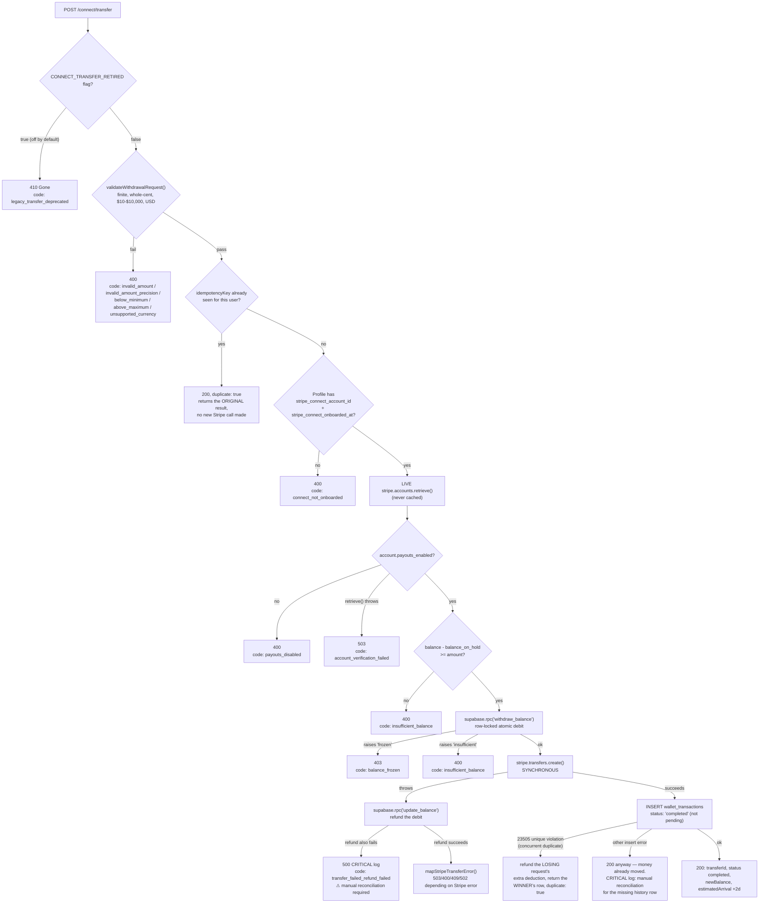
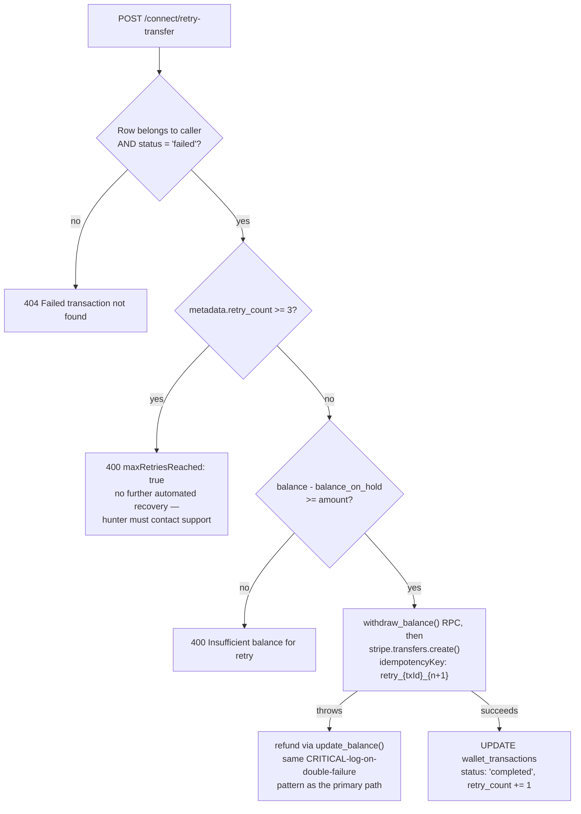
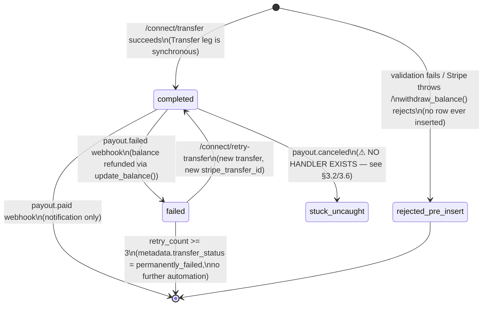
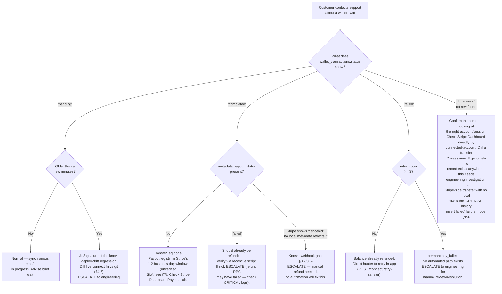

# Bounty Withdrawal System Technical Specification

> **Scope note (read first):** This document describes **exactly how Bounty's withdrawal system currently works**, as implemented in this production codebase (`Bounty-production`, Supabase project `xwlwqzzphmmhghiqvkeu`), verified against both the git-tracked source and the **live database schema** on 2026-07-17/18. It does **not** describe how Stripe's APIs are generally documented to behave — every claim below is sourced from a specific file, line range, or a live SQL query, cited inline. Where Bounty's code relies on undocumented Stripe timing behavior, that is called out explicitly as "per this codebase's own comments," not as general Stripe doctrine.
>
> This is a companion to `docs/payments/WITHDRAWAL_SYSTEM_RUNBOOK.md` (the existing architecture/state-machine runbook, last updated 2026-07-18). That document is the deeper technical reference for the state machine and idempotency guarantees; this document restructures and extends the same verified facts into a support-operations-oriented spec, and adds several **new findings** (marked ⚠️ **NEW FINDING**) surfaced while producing it that are not yet in the runbook.
>
> **Only one withdrawal path exists in production.** It moves a hunter's `profiles.balance` (an internal ledger balance, not a Stripe balance) to their bank account via a Stripe Connect Express account. There is no other live withdrawal mechanism — a second, more elaborate `withdrawals`/`withdraw_balance_v2()` schema existed in the database but was **dropped 2026-07-18** after being confirmed unused (0 rows, zero code references). If you encounter documentation, code comments, or Stripe support tickets referencing a `reserved` status or `cancel_withdrawal()`, they refer to that dead schema — ignore them.
>
> **No test/staging environment exists.** There is exactly one Supabase project (production, `xwlwqzzphmmhghiqvkeu`) and Stripe is in **live mode** (`acct_1PGppVJekUCspsfJ`). Any testing procedure in this document that involves calling real endpoints moves real money and must not be executed without a human directly present and authorizing it.
>
> **Verified 2026-07-17:** production Supabase Edge Functions have been redeployed directly (bypassing git) at least three times in the preceding week, twice introducing real regressions. Do not assume `git log` reflects what's currently live — see §4.7.
>
> **Update 2026-07-19 (DEPLOYED):** the three gaps this document originally found and flagged as "not fixed" — the bank-account selector not being wired to the transfer call (§3.8), the missing `payout.canceled` webhook handler (§3.2, §3.6, §4.8 item 2), and the never-applied balance-floor/one-pending-withdrawal migration (§2.1, §4.8 items 3–4) — have all been fixed in code, deployed to production Edge Functions (`connect` v30, `webhooks` v32 — verified byte-for-byte identical to git HEAD post-deploy), and applied to the production database (`check_balance_non_negative` confirmed `convalidated=true`; `idx_wallet_tx_one_pending_withdrawal` confirmed `indisvalid=true`). The body of this document below (architecture description, code excerpts, failure-mode tables) still reflects the pre-fix behavior as a historical record of what was found — treat §3.8, §4.8 items 2–4, and the `payout.canceled` gap in §3.2/3.6 as **resolved**, not open. See the session deliverable and `docs/payments/WITHDRAWAL_SYSTEM_RUNBOOK.md` for the authoritative current state going forward. The residual architectural limitation on per-withdrawal destination precision under Stripe's automatic/commingled payout model (documented next to `resolveWithdrawalDestination()` in the code) was *not* fully closed and remains a known, accepted limitation.

---

## 1. Withdrawal Lifecycle

### 1.1 End-to-end path

```
┌─────────────────────────────────────────────────────────────────────────────┐
│ 1. Hunter taps "Withdraw" on the wallet tab                                 │
│    app/tabs/wallet-screen.tsx → components/withdraw-with-bank-screen.tsx    │
└─────────────────────────────────────────────────────────────────────────────┘
                                      │
                                      ▼
┌─────────────────────────────────────────────────────────────────────────────┐
│ 2. Client-side checks (withdraw-with-bank-screen.tsx handleWithdraw())      │
│    • Email verified (useEmailVerification().canWithdrawFunds)               │
│    • Amount parses, > 0                                                     │
│    • Amount >= minWithdrawal (server-supplied; falls back to a local        │
│      MIN_WITHDRAWAL_AMOUNT = 10 constant, lib/constants.ts:15)              │
│    • Amount <= maxWithdrawal (server-supplied only; no local fallback cap)  │
│    • Amount <= server-reported available balance                           │
│    • hasConnectedAccount === true (from /connect/verify-onboarding)         │
│    • At least one bank account exists (from /connect/bank-accounts)         │
│    • A bank account is "selected" in the UI (see §4.8 for what this         │
│      selection actually does — it is less than it appears)                 │
│    → Confirmation Alert.alert(), irreversibility warning shown to user      │
└─────────────────────────────────────────────────────────────────────────────┘
                                      │  user confirms
                                      ▼
┌─────────────────────────────────────────────────────────────────────────────┐
│ 3. POST {API_BASE_URL}/connect/transfer                                     │
│    Headers: Authorization: Bearer <Supabase JWT>                            │
│    Body: { amount, currency: 'usd', idempotencyKey }                        │
│    idempotencyKey is generated once per screen mount                        │
│    (`withdraw_${userId}_${Date.now()}`) and reused across retries of the    │
│    same attempt; rotated to a fresh value after a successful withdrawal.    │
│    20-second client-side AbortController timeout.                          │
└─────────────────────────────────────────────────────────────────────────────┘
                                      │
                                      ▼
┌─────────────────────────────────────────────────────────────────────────────┐
│ 4. supabase/functions/connect/index.ts — POST /connect/transfer             │
│    (Deno Edge Function, verify_jwt=false at the gateway; the function       │
│    self-authenticates via supabase.auth.getUser(token) on every call)       │
│                                                                              │
│    a. CONNECT_TRANSFER_RETIRED flag check → 410 Gone if a Phase-2 cutover   │
│       flag is on (off by default in production as of this writing)         │
│    b. validateWithdrawalRequest() — finite amount, whole-cent, $10–$10,000  │
│    c. Idempotency replay check — SELECT wallet_transactions WHERE           │
│       (user_id, idempotency_key). If found, return the recorded result     │
│       instead of re-processing (duplicate: true).                          │
│    d. Fetch profiles.balance, balance_on_hold, stripe_connect_account_id,   │
│       stripe_connect_onboarded_at                                          │
│    e. If not onboarded → 400 connect_not_onboarded                         │
│    f. LIVE stripe.accounts.retrieve() → if !payouts_enabled → 400           │
│       payouts_disabled (checked on every attempt, never cached)            │
│    g. Pre-check: balance - balance_on_hold >= amount → else 400             │
│       insufficient_balance                                                 │
│    h. supabase.rpc('withdraw_balance', ...) — atomic, row-locked debit     │
│       (see §4.4 for the exact SQL function)                                │
│    i. stripe.transfers.create({ destination: connectedAccountId, ... })     │
│       — moves funds from Bounty's PLATFORM Stripe balance into the         │
│       CONNECTED ACCOUNT's Stripe balance. This call is SYNCHRONOUS: by     │
│       the time it returns without throwing, the money has already moved.   │
│    j. INSERT wallet_transactions with status: 'completed' IMMEDIATELY —    │
│       not 'pending'. See §1.2 for why this is load-bearing.                │
└─────────────────────────────────────────────────────────────────────────────┘
                                      │
                                      ▼
┌─────────────────────────────────────────────────────────────────────────────┐
│ 5. Response to client: { transferId, status: 'completed', amount,          │
│    newBalance, estimatedArrival: now+2 days,                               │
│    message: 'Transfer initiated. Funds typically arrive in 1-2 business    │
│    days.' } — this 1-2 business day figure is a hardcoded client-facing    │
│    estimate in the code (connect/index.ts:832,852), not a measured SLA.    │
└─────────────────────────────────────────────────────────────────────────────┘
                                      │
                                      ▼  (asynchronous, hours to days later,
                                          entirely Stripe-managed)
┌─────────────────────────────────────────────────────────────────────────────┐
│ 6. Stripe sweeps the CONNECTED ACCOUNT's Stripe balance to the hunter's     │
│    bank account on its own schedule, as a Stripe Payout object. Bounty's   │
│    code does not initiate or control the timing of this step.             │
└─────────────────────────────────────────────────────────────────────────────┘
                                      │
                                      ▼
┌─────────────────────────────────────────────────────────────────────────────┐
│ 7. supabase/functions/webhooks/index.ts — POST /webhooks (HMAC-verified)   │
│    • payout.paid   → in-app notification only, no balance/status change    │
│    • payout.failed → find the matching completed withdrawal row by         │
│      (user, exact amount), mark it 'failed', refund via update_balance(),  │
│      set profiles.payout_failed_at / payout_failure_code, notify           │
│    • account.updated / capability.updated → sync Connect capability        │
│      snapshot onto profiles (does not affect an in-flight withdrawal)      │
└─────────────────────────────────────────────────────────────────────────────┘
                                      │
                                      ▼
┌─────────────────────────────────────────────────────────────────────────────┐
│ 8. Terminal state: wallet_transactions.status = 'completed' (money         │
│    delivered or payout still pending on Stripe's side) or 'failed'         │
│    (balance already refunded by the webhook handler).                     │
└─────────────────────────────────────────────────────────────────────────────┘
```

### 1.2 Why step 4j (`status: 'completed'` immediately) is not a stylistic choice

`stripe.transfers.create({ destination: connectedAccountId })` is a **platform-balance-to-connected-account-balance** transfer, not a bank payout. Per this codebase's own inline comment (`supabase/functions/connect/index.ts:749-757`), Stripe does not deliver a `transfer.paid` webhook for this specific operation — that event belongs to a legacy recipient-transfer API. If the row were inserted as `'pending'` and the code waited for a webhook to promote it, **nothing would ever promote it** — it would be stuck forever. This exact regression happened in production on 2026-07-17 (deployed directly, outside git) and left a real $38.00 withdrawal for user `jordenhoward2` stuck at `status: 'pending'` for 6+ hours before being caught and fixed (commit `f393e30a`). If you ever see this code writing `'pending'` on the synchronous-success path, treat it as an active incident, not a style preference.

### 1.3 The two Stripe objects involved, and which one is actually async

| Object | Direction | Bounty code that touches it | Synchronous? |
|---|---|---|---|
| **Transfer** | Platform Stripe balance → connected account's Stripe balance | `connect/index.ts` `/transfer`, `/retry-transfer` | **Synchronous** — completes within the API call |
| **Payout** | Connected account's Stripe balance → hunter's actual bank account | Entirely Stripe-managed; Bounty only reacts to `payout.paid`/`payout.failed` webhooks | **Asynchronous** — Stripe's own schedule, not controlled or timed by Bounty's code |

---

## 2. Automated Flow (Decision Tree)

This is the actual branching logic in `supabase/functions/connect/index.ts` `POST /connect/transfer`, in execution order. Every branch below corresponds to a real `if`/`return` in the code — none are hypothetical.



**Retry path** (`POST /connect/retry-transfer { transactionId }`) is a parallel, narrower flow:



### 2.1 Idempotency and concurrency guarantees actually implemented

| Guard | Mechanism (exact source) | Prevents |
|---|---|---|
| Client double-tap / retry | Stable `idempotencyKeyRef` generated once per screen mount, reused across retries (`withdraw-with-bank-screen.tsx:100`) | Duplicate submission of the same logical attempt |
| DB-level dedup | `idx_wallet_tx_withdrawal_idempotency` — unique on `(user_id, idempotency_key) WHERE type='withdrawal'` (migration `20260711_add_withdrawal_idempotency.sql`) — **confirmed present in the live database** | Two rows for one idempotency key even under a race |
| Stripe-level dedup | `stripe.transfers.create(..., { idempotencyKey: transfer_${userId}_${key}_${amountCents} })` | A second real Transfer even if two requests race past the DB check |
| Balance correctness on a lost insert-race | On `23505` unique-violation, the losing request refunds its own extra `withdraw_balance()` deduction and replays the winner's transaction | Double-debiting a user when two concurrent requests share one idempotency key |
| Single in-flight withdrawal | `withdraw_balance()` (`20260417_add_balance_on_hold_dispute_freeze.sql:283`) uses `SELECT ... FOR UPDATE` on the profile row | Two concurrent withdrawals both reading a stale balance |
| Webhook replay | `stripe_events` upserted on `stripe_event_id` before processing; `transfer.failed`/`payout.failed` additionally check `metadata.transfer_status`/`metadata.payout_status` before refunding | Double-refunding on a redelivered webhook |
| Retry vs. late webhook race | Optimistic-lock guard: UPDATE re-filtered on `.eq('stripe_transfer_id', transfer.id)` after the initial SELECT | An old transfer's `transfer.failed` corrupting a newer, in-flight retry |

⚠️ **NEW FINDING — verified live 2026-07-18, contradicts the migration file:** `supabase/migrations/20260410_harden_withdrawal_flow.sql` defines (a) a `CHECK (balance >= 0)` constraint named `check_balance_non_negative` on `profiles`, and (b) a unique partial index `idx_wallet_tx_one_pending_withdrawal` limiting a user to one pending withdrawal at a time. **Neither exists in the live production database** (confirmed via direct `information_schema`/`pg_indexes` queries against project `xwlwqzzphmmhghiqvkeu`, and neither migration appears in `supabase_migrations.schema_migrations`). This migration file was apparently never applied. In practice this gap is lower-risk than it sounds because (per §1.2) a row is essentially never actually `'pending'` for more than the duration of one request under the current synchronous-transfer design — but **`profiles.balance` itself currently has no database-level floor; it is protected only by application logic in `withdraw_balance()`/`update_balance()`.** Do not assume this constraint exists when reasoning about worst-case balance-corruption scenarios.

---

## 3. Support Staff Runbook

For every scenario: what to say, what to check, and — critically — where automated recovery stops and a human decision is required.

### 3.1 "My withdrawal is stuck"

**Symptoms:** Hunter reports the app shows a withdrawal that hasn't changed status in a long time.

**Investigation:**
1. Find the row: `wallet_transactions` where `user_id = <hunter>` and `type = 'withdrawal'`, most recent first.
2. Check `status`:
   - **`'completed'`** with no `payout_status` in `metadata` → this is *not* actually stuck. The platform→connected-account Transfer succeeded; Stripe's connected-account→bank Payout just hasn't resolved yet (normal, can take 1-2 business days) or hasn't been checked. Cross-reference Stripe Dashboard → Connect → the hunter's account → Payouts.
   - **`'pending'`** and more than a few seconds old → **this should never happen** under the current code (§1.2). This is the exact signature of the 2026-07-17 production regression. Before doing anything else, diff the deployed `connect` function against git (§4.7) — if they differ, this is an active incident requiring an engineering redeploy, not a support-level fix.
   - **`'failed'`** → the balance should already show as refunded. Verify with `scripts/reconcile_and_triage.sql`. The hunter can self-serve a retry via the app (`POST /connect/retry-transfer`), capped at 3 attempts.

**Internal tools:** Supabase SQL editor / `scripts/reconcile_and_triage.sql`; Stripe Dashboard → Connect → [account] → Payouts; Supabase Edge Function logs for `connect` and `webhooks`, grep `[connect/transfer]` and `CRITICAL`.

**Escalation:** Any `'pending'` row older than a few minutes → escalate to engineering immediately (possible deploy-drift regression). Any `CRITICAL` log line tied to this transaction → escalate (means an automated refund step failed and requires manual reconciliation).

### 3.2 "I never received my money"

**Symptoms:** App shows the withdrawal as completed; no money in the bank account.

**Investigation:**
1. Confirm `wallet_transactions.status = 'completed'`. This only proves the platform→connected-account Transfer succeeded — it does **not** prove the connected-account→bank Payout has landed.
2. Check the Stripe Dashboard for the connected account's Payouts. If a Payout is `in_transit`, this is normal — standard bank payouts take 1-2 business days per the app's own copy (this is not a guaranteed SLA; see §7).
3. If a `payout.failed` webhook fired, `wallet_transactions.status` should have flipped to `'failed'` and the balance should show as refunded — check `metadata.payout_failure_code`/`payout_failure_message`.
4. **⚠️ Known gap: no handler exists for the Stripe `payout.canceled` event.** `supabase/functions/webhooks/index.ts` only switches on `payout.paid` and `payout.failed` — there is no `case 'payout.canceled'`. If Stripe cancels an in-transit payout (which can happen independently of a "failure"), Bounty's system will not react at all: no status change, no balance refund, no notification. If the Stripe Dashboard shows a payout in a `canceled` state and the hunter's local row still says `'completed'` with no failure metadata, **this is that gap** — escalate to engineering for a manual balance correction; do not tell the hunter to "just wait."

**Internal tools:** Stripe Dashboard Connect → Payouts (source of truth for whether money actually left the connected account); `wallet_transactions.metadata`.

**Escalation:** Any payout showing `canceled` or `failed` in Stripe with no corresponding `status='failed'` row locally → engineering escalation (manual refund required, no automated path).

### 3.3 "The app says completed but my bank doesn't [show it]"

Same investigation as §3.2 step 2 — `'completed'` in the app means the Transfer leg succeeded, not that the bank-level Payout has landed. This is the most common source of hunter confusion given the two-hop design (§1.3); it is expected behavior within the 1-2 business day window, not a bug, unless that window has clearly passed.

### 3.4 "My Stripe account isn't verified" / onboarding won't complete

**Symptoms:** Hunter can't get past onboarding, or `hasConnectedAccount` stays false.

**Investigation:**
1. `GET`/`POST /connect/verify-onboarding` calls `stripe.accounts.retrieve()` live and checks `charges_enabled && payouts_enabled`. This is never cached — an account that was fine yesterday can fail today if Stripe now requires additional info.
2. Check `account.requirements` in the Stripe Dashboard for the specific missing requirement (identity document, SSN, address, etc.) — the app does not surface Stripe's specific requirement text to the hunter; support may need to relay it manually or direct them back through onboarding (`app/wallet/connect/embedded-onboarding.tsx`, an embedded Stripe Connect Components WebView).
3. `profiles.stripe_connect_onboarded_at` is set exactly once on the *first* transition to fully-onboarded and is **never cleared automatically** — so a hunter who was onboarded in the past but has since become restricted will still show `stripe_connect_onboarded_at` populated. Rely on `stripe_connect_payouts_enabled` (kept live-synced by the `account.updated`/`capability.updated` webhooks, `syncConnectAccountToProfile()`) for current status, not the onboarded-at timestamp.

**Internal tools:** Stripe Dashboard → Connect → [account] → account requirements; `profiles.stripe_connect_requirements` (jsonb snapshot, kept in sync by the webhook).

### 3.5 "My withdrawal failed"

**Investigation:** Read `wallet_transactions.status = 'failed'` and `metadata.transfer_status` (`'failed'` vs `'permanently_failed'`) or `metadata.payout_status`. The balance should already be refunded automatically in both cases (`update_balance()` RPC called by the relevant webhook handler). If `metadata.transfer_status = 'permanently_failed'`, the hunter has exhausted all 3 client-side retries and there is genuinely no further automated path — see §3.9 for what support can and cannot do about this.

### 3.6 "My payout was canceled"

See §3.2 — **there is no code path that handles a Stripe `payout.canceled` event.** If the hunter is describing this specific Stripe status (visible in Stripe Dashboard, or reported to them by their bank), this is the webhook gap; escalate to engineering, do not expect the balance to have auto-corrected.

### 3.7 "My bank account disappeared"

**Investigation:** Bank accounts are **not stored in Bounty's database at all** — `GET /connect/bank-accounts` calls `stripe.accounts.listExternalAccounts()` live against Stripe every time the screen loads. If an account is missing, it was removed on Stripe's side — either the hunter (or someone with access to their session) called `DELETE /connect/bank-accounts/:id`, or Stripe itself removed it (e.g. the bank rejected/closed it). There is no local audit log beyond the Edge Function's `console.log` output showing who called the delete endpoint and when — check Supabase Edge Function logs for `connect`, not a database table.

### 3.8 "I accidentally withdrew to the wrong account"

**⚠️ NEW FINDING — this is not what it looks like.** Read this before telling a hunter their selection caused the problem.

The withdraw screen's bank-account radio-button list (`components/withdraw-with-bank-screen.tsx`) is used **only** to populate the confirmation dialog's text ("Withdraw $X to your Chase account ending in 1234?") and for local UI state (`selectedBankAccount`). The actual `POST /connect/transfer` request body is `{ amount, currency, idempotencyKey }` — **it does not include any bank account identifier**, and the client never calls `POST /connect/bank-accounts/:id/default` to make the selected account the active one before withdrawing.

`stripe.transfers.create()` on the server side moves money to the hunter's **Stripe Connect account balance**, not to a specific external bank account. Which bank account actually receives the money is decided later, entirely by Stripe, based on whichever external account is currently `default_for_currency` on that Connect account — independent of what the hunter tapped in the app at withdrawal time.

**Practical consequence:** if a hunter has two linked bank accounts and taps the non-default one expecting money to go there, it will still go to whichever account Stripe currently has marked default — the confirmation dialog's account name can be misleading. If a hunter reports this exact symptom, it is very likely this gap, not user error. **Investigation:** check which external account was `default_for_currency` on their Connect account (Stripe Dashboard) at the time of the transfer, versus which one the app's confirmation dialog named. **Resolution:** this is a product/engineering fix (either send the selected account ID through to a Stripe API call that supports specifying a destination, or call the `/default` endpoint before transferring) — support cannot fix it per-incident beyond confirming which account the money actually reached.

### 3.9 General resolution/escalation matrix

| Situation | Support can resolve | Requires engineering | Requires product/business decision |
|---|---|---|---|
| Hunter wants to retry a failed withdrawal, < 3 attempts used | ✅ direct them to retry in-app | | |
| Hunter has hit the 3-retry cap (`permanently_failed`) | | ✅ no admin retry endpoint exists — see §4.2 | |
| `'pending'` row stuck > a few minutes | | ✅ likely deploy-drift regression, needs a code fix + redeploy | |
| `payout.canceled` scenario (§3.2/§3.6) | | ✅ no automated refund path exists | |
| Balance frozen by an open Stripe dispute | direct them to wait for dispute resolution | | if dispute is **lost**, `balance_frozen` stays true intentionally pending manual admin review — someone must decide to clear it |
| Suspected wrong-account withdrawal (§3.8) | confirm the facts (which account got the money) | ✅ the underlying selection-not-wired-through bug | |
| Hunter disputes the $10 minimum or fee structure | explain policy | | ✅ these are configured values (`WITHDRAW_MIN_USD`/`WITHDRAW_MAX_USD`), not fixed in stone |

---

## 4. Engineering Runbook

### 4.1 API endpoints (all served by Supabase Edge Functions, base path `{API_BASE_URL}/connect` or `/wallet`)

| Method | Path | Function | Purpose |
|---|---|---|---|
| POST | `/connect/transfer` | `connect` | The withdrawal endpoint — see §1, §2 |
| POST | `/connect/retry-transfer` | `connect` | Retry a `'failed'` withdrawal, capped at 3 attempts |
| POST | `/connect/create-account-link` | `connect` | Hosted Stripe onboarding link (legacy path; embedded components is the routed UI) |
| POST | `/connect/create-account-session` | `connect` | Creates a Stripe Connect **Embedded Components** session (the actual onboarding UI path) |
| GET | `/connect/embedded` | `connect` | HTML shim loaded in a React Native WebView to host embedded onboarding/payments/payouts components; publicly reachable (no auth header — WebView's first navigation can't set one), never exposes the Stripe secret key |
| POST | `/connect/verify-onboarding` | `connect` | Live check of `charges_enabled`/`payouts_enabled`; sets `stripe_connect_onboarded_at` once; clears `payout_failed_at` when payouts re-enable |
| GET | `/connect/bank-accounts` | `connect` | Lists external accounts live from Stripe (not cached, not stored locally) |
| POST | `/connect/bank-accounts` | `connect` | **410 Gone** — manual entry deprecated; must use Stripe Financial Connections instead |
| DELETE | `/connect/bank-accounts/:id` | `connect` | Removes an external account from the Connect account |
| POST | `/connect/bank-accounts/:id/default` | `connect` | Sets an external account as `default_for_currency` — **never called by the withdraw screen itself** (§3.8) |
| GET | `/wallet/balance` | `wallet` | Returns `profiles.balance` (sole source of truth — no ledger-derived reconciliation as of 2026-07-18, see §4.5) plus `payout_failed_at`/`payout_failure_code` |
| GET | `/wallet/transactions` | `wallet` | Paginated `wallet_transactions` history |
| POST | `/webhooks` (also accepts `/webhooks/stripe`) | `webhooks` | All inbound Stripe events |

### 4.2 Edge Functions inventory (withdrawal-relevant)

| Function | File | Auth model |
|---|---|---|
| `connect` | `supabase/functions/connect/index.ts` (1105 lines) | `verify_jwt=false` at the gateway; self-authenticates every request via `supabase.auth.getUser(bearerToken)` |
| `connect` (validation helpers) | `supabase/functions/connect/withdrawal-validation.ts` (205 lines) | Pure/unit-tested; **must be kept manually in sync** with the copy inlined into `index.ts` — the Deno bundler used here does not support local imports |
| `webhooks` | `supabase/functions/webhooks/index.ts` (1747 lines) | Manual HMAC-SHA256 verification of the `Stripe-Signature` header (constant-time compare, 5-minute timestamp skew tolerance) — not Supabase JWT auth |
| `wallet` | `supabase/functions/wallet/index.ts` (902 lines) | Same self-authenticating pattern as `connect` |

There is **no admin/support-side retry or refund endpoint**. A withdrawal stuck beyond the 3-attempt client cap has no automated resolution path; recovery requires a manually-run, service-role SQL script.

A parallel Fastify server (`services/api/src/routes/wallet.ts` and `consolidated-webhooks.ts`) exists in the repo but is **confirmed deprecated** — it sets an `X-Deprecated: true` response header and is covered by `services/api/src/__tests__/wallet-routes-deprecated.test.ts`. It is not the live path; do not use it as a reference for current behavior.

### 4.3 Database tables (withdrawal-relevant columns only)

**`profiles`** (relevant columns): `balance NUMERIC(12,2)`, `balance_on_hold NUMERIC(12,2)` (default 0), `balance_frozen BOOLEAN`, `stripe_connect_account_id`, `stripe_connect_onboarded_at`, `stripe_connect_charges_enabled`, `stripe_connect_payouts_enabled`, `stripe_connect_onboarding_complete`, `stripe_connect_requirements JSONB`, `payout_failed_at`, `payout_failure_code`.

**`wallet_transactions`** (`20251001_baseline_schema.sql:122`): `id`, `user_id`, `bounty_id`, `type TEXT CHECK (type IN ('escrow','release','refund','deposit','withdrawal'))` — note `'dispute_loss'` is also written by the dispute-loss webhook path despite not appearing in this CHECK list (worth an engineering follow-up to confirm the constraint was widened), `amount NUMERIC(12,2)` (negative for withdrawals), `status TEXT CHECK (status IN ('pending','completed','failed'))` — **exactly 3 values, no `'reserved'`**, `stripe_transfer_id`, `stripe_connect_account_id`, `idempotency_key`, `metadata JSONB` (carries `transfer_status`, `payout_status`, `retry_count`, failure codes — the fine-grained sub-state that the 3-value `status` column can't express).

**`notifications`**: in-app inbox, written directly by `payout.paid`/`payout.failed` handlers. **`notifications_outbox`**: a separate push-notification queue, processed by the `process-notification` function — **only used for deposit (`payment_intent.succeeded`) notifications in the withdrawal-adjacent code paths inspected; `payout.paid`/`payout.failed` write straight to the in-app `notifications` table, not the push outbox.** Do not assume a hunter gets a push notification for withdrawal/payout events — verify against `process-notification`/`push_tokens` if this matters for an incident.

**`stripe_events`**: webhook replay log, upserted on `stripe_event_id` before processing each event.

### 4.4 Key RPCs (all `service_role`-only, none callable by an authenticated client directly)

| RPC | File | Behavior |
|---|---|---|
| `withdraw_balance(p_user_id, p_amount)` | `20260417_add_balance_on_hold_dispute_freeze.sql:283` | `SELECT ... FOR UPDATE` row lock; raises if `balance_frozen`; raises (SQLSTATE `23514`) if `balance - balance_on_hold < p_amount`; deducts and returns new balance |
| `update_balance(p_user_id, p_amount)` | `20260115_add_update_balance_rpc.sql` | Generic credit/debit, used to refund withdrawals on Stripe failure |
| `fn_open_dispute_hold` / `fn_close_dispute_hold` | `20260417_add_balance_on_hold_dispute_freeze.sql:79,184` | Places/releases `balance_on_hold` for in-app (non-Stripe-chargeback) disputes; capped at the poster's current balance |

### 4.5 Status transitions (state machine)



`'pending'` exists in the `status` CHECK constraint but a correctly-behaving `/connect/transfer` never writes it for a new withdrawal (§1.2). Its presence is defensive/forward-compatible only.

⚠️ Removed 2026-07-18: `GET /wallet/balance` previously "reconciled" a cached `$0` balance by summing completed `wallet_transactions` and writing the sum back to `profiles.balance` whenever the cached value was exactly zero. This was removed entirely (not patched) because it created a real double-spend vector for in-flight debits and silently undid deliberate administrative balance write-offs. If you see this pattern reintroduced anywhere (including in the deprecated Fastify server), treat it as a regression.

### 4.6 Configuration

| Env var | Default | Effect |
|---|---|---|
| `WITHDRAW_MIN_USD` | `10` | Minimum withdrawal, guarded against a non-numeric override silently disabling the check (`Number.isFinite` fallback) |
| `WITHDRAW_MAX_USD` | `10000` | Maximum single withdrawal |
| `CONNECT_TRANSFER_RETIRED` | unset (`false`) | Staged kill-switch for the legacy withdrawal path as part of an in-progress, **not yet live**, "Phase 2" migration to a different payments architecture (`supabase/functions/bounty-payments`). Off in production as of this writing — do not assume it will stay off without checking. |

### 4.7 Verifying production matches git (do this first, every session)

Production Edge Functions have been redeployed directly at least three times in the week preceding this document, twice with real regressions (a stuck-withdrawal bug on 2026-07-17, and untracked-drift RLS/schema changes on 2026-07-17/18). **Do not trust `git log` alone.** Before relying on any assumption about current live behavior, fetch the deployed source for `connect` and `webhooks` and diff against the local repo (strip CRLF before diffing). If they differ and the difference isn't explained by a known, in-progress change, treat it as a live incident.

### 4.8 Known code gaps (engineering backlog)

> **Update 2026-07-21 (RESOLVED):** items 1–6 below have all been fixed and deployed to production as part of two follow-up hardening passes (2026-07-19 and 2026-07-21). See `docs/withdrawals/` — a full 6-document operational doc set — for the current, authoritative state; this section is left as a historical record of what was originally found. Item 7 (`profiles` SELECT RLS) remains **deliberately not fixed** — confirmed during the 2026-07-21 pass to be an app-wide change (breaks the admin panel and 4+ client read paths), not safely scoped to withdrawal work; see the Production Readiness Review delivered that session for the recommended migration path.

1. ~~**Selected-bank-account is not wired to the transfer call**~~ (§3.8) — **fixed 2026-07-19**: the selected account is now resolved and promoted to `default_for_currency` before the balance is debited.
2. ~~**No `payout.canceled` webhook handler**~~ (§3.2, §3.6) — **fixed 2026-07-19**. `transfer.reversed`, `payout.updated`, and `account.application.deauthorized` handlers were additionally added **2026-07-21**.
3. ~~**`profiles.balance` has no live database-level non-negative constraint**~~ (§2.1) — **fixed 2026-07-19**, `check_balance_non_negative` confirmed live.
4. ~~**No index preventing more than one pending withdrawal per user**~~ — **fixed 2026-07-19**, `idx_wallet_tx_one_pending_withdrawal` confirmed live.
5. ~~**No admin/support-side retry or refund tool**~~ — **fixed 2026-07-21**: new `admin-withdrawals` Edge Function (force-retry, manual balance adjustment, fully audited via `admin_action_log`) plus an admin UI screen.
6. ~~**No scheduled reconciliation job**~~ — **fixed 2026-07-21**: `run_withdrawal_reconciliation()` runs daily via `pg_cron`, writing findings to `reconciliation_findings`.
7. **`profiles` SELECT RLS is effectively unrestricted** for any authenticated (or anon) caller across all 62 columns, including `balance`, `stripe_connect_account_id`, `risk_level`, `email`, `phone` — a read-side counterpart to a write-side hole that was fixed 2026-07-17. **Still not fixed** — confirmed 2026-07-21 to require an app-wide change (a `public_profiles` view, migrating 4+ client call sites off `select('*')`, and an admin-role-aware RLS branch to avoid breaking the admin panel), not something safely scoped to a withdrawal-focused pass.

---

## 5. Failure Modes

| Failure | Why it occurs | Detection | Recovery | Customer-facing message (as coded) | Internal action |
|---|---|---|---|---|---|
| Insufficient balance | Requested amount exceeds `balance - balance_on_hold` | 400 `insufficient_balance`, checked twice (pre-check + inside `withdraw_balance()`) | None needed — no balance touched | "Insufficient available balance. Part of your balance may be on hold or already reserved." | none |
| Duplicate request (double-tap/retry) | Same `idempotencyKey` submitted twice | DB unique index `23505`, or the upfront replay SELECT | Losing request refunds its own extra deduction, replays winner's response | "This withdrawal was already submitted and is being processed." | none — self-healing |
| Stripe API timeout / network failure (client→server) | Client's own 20s `AbortController` fires | `AbortError` on the client | User can retry — same idempotency key reused | "The request took too long to complete. Please check your connection and try again." | none |
| Stripe API unreachable (server→Stripe) | `StripeConnectionError`/`api_connection_error` during `transfers.create()` | try/catch around `transfers.create()` | Balance refunded via `update_balance()` before responding | "We could not reach our payment provider. Your balance has not been charged — please try again." | none unless refund itself fails (see below) |
| Balance refund also fails after a failed transfer | Two consecutive Stripe/DB failures | `CRITICAL` log line, all-caps | **None automated** | "Transfer failed and your balance may have been affected. Please contact support for assistance." | Manual reconciliation required — grep `CRITICAL` in `connect` function logs |
| Transaction history insert fails after a successful transfer | DB write failure post-Stripe-success | `CRITICAL` log line | **None automated** — money already moved, so no error is shown to the user | "Transfer initiated. Funds typically arrive in 1-2 business days." (+ `warning` field) | Manual reconciliation — find and backfill the missing `wallet_transactions` row |
| Webhook delayed | Normal Stripe delivery latency | N/A | N/A — eventual consistency by design | N/A | none unless delay is extreme |
| Webhook never received | Stripe delivery failure, endpoint misconfiguration | No corresponding status change ever appears | **None automated** | N/A | Check Stripe Dashboard → Developers → Webhooks for delivery failures |
| Transfer succeeds, bank-level payout fails | `payout.failed` fires after the Transfer leg already completed | Webhook handler matches by `(user, exact amount)` against the most recent `'completed'` withdrawal | Automated: status → `'failed'`, balance refunded via `update_balance()`, `profiles.payout_failed_at` set, in-app notification sent | "Your payout of $X could not be processed. [Stripe failure message]" | If two unresolved completed withdrawals of the identical amount exist for one user, only the most recent is matched — logged, not silently wrong, but worth a manual check in that specific edge case |
| Payout **canceled** | Stripe cancels an in-transit payout | **No handler exists** (§3.2, §3.6) | **None automated** | none shown | Escalate to engineering; manual balance correction |
| Stripe Connect account restricted | Missing requirements, disabled by Stripe | Live `stripe.accounts.retrieve()` check on every withdrawal attempt | Blocks before balance is touched | "Payouts are currently disabled on your account. Please review and update your payout details, then try again." | none — self-service via onboarding |
| Bank rejected payout | Same as "bank-level payout fails" above | Same as above | Same as above | Same as above | Same as above |
| Identity verification required | Stripe `requirements` flags a missing document | Surfaced via `verify-onboarding`/`account.updated` sync, not a distinct error path | User must complete embedded onboarding again | Generic onboarding-incomplete messaging | none automated beyond the sync |
| Currency mismatch | Anything other than `usd` submitted | 400 `unsupported_currency` at validation | N/A | "Only USD withdrawals are supported." | none |
| Invalid connected account | `account_invalid`/`transfers_not_allowed` from Stripe | Caught in `mapStripeTransferError()` | Balance refunded | "Your linked bank account cannot receive transfers right now..." | none |
| Race: concurrent withdrawals for one user | Two requests, enough balance for only one | `FOR UPDATE` row lock in `withdraw_balance()` | Serialized — one wins, one gets `insufficient_balance` on the now-stale balance | Standard insufficient-balance message | none — correct by design |
| Race: retry vs. late `transfer.failed` webhook | Retry replaces `stripe_transfer_id` between webhook SELECT and UPDATE | Optimistic-lock guard fires (`.eq('stripe_transfer_id', ...)` returns 0 rows) | **None automated** in that specific race window | N/A | `CRITICAL` log: "transfer.failed race condition detected... Manual review required" |
| Idempotency conflict at the Stripe layer | `idempotency_error`/`StripeIdempotencyError` | Caught in `mapStripeTransferError()` | None — user must start a new attempt | "This withdrawal request conflicts with a previous attempt. Please start a new withdrawal." | none |
| Balance manipulation (historical) | Pre-2026-07-17, `profiles` UPDATE RLS allowed a client to write `balance` directly | N/A going forward (fixed) | Fixed via `prevent_client_writes_to_protected_profile_columns` trigger | N/A | If investigating an old balance discrepancy, check whether it predates the fix (§9.1) |

---

## 6. Operations Decision Tree



---

## 7. SLA Expectations

**Important framing:** as of this writing, Bounty has processed **very few real withdrawals in production** — the operational history available for grounding SLA claims is thin (a single-digit number of real attempts, per prior audit sessions). The figures below are therefore split into **what the code promises the user** (verifiable, code-grounded) versus **what would need to be true for that promise to hold** (Stripe-side, outside Bounty's direct control and not independently measured by this codebase). Do not present the second category to a customer as a guaranteed internal SLA — it isn't backed by internal measurement.

| Stage | What the code says | Grounded in |
|---|---|---|
| Client → `/connect/transfer` response | Client aborts after 20 seconds if no response | `withdraw-with-bank-screen.tsx:327` `AbortController` timeout |
| Transfer creation (platform → connected account) | Synchronous — completes within the same request, typically sub-second in practice | `connect/index.ts` — no polling/waiting logic exists because none is needed |
| "Estimated arrival" shown to the user | Hardcoded `now + 2 days` in the API response, and "1-2 business days" in UI copy | `connect/index.ts:589,812,831,851`; `withdraw-with-bank-screen.tsx:296,379,659` |
| Payout (connected account → bank) | **Not measured by this codebase at all** — entirely Stripe's own schedule | No timing/polling code exists for this leg; it's purely webhook-reactive |
| Debit-card instant payouts | **Not offered.** `instant_payouts: false` is explicitly configured in the Embedded Components payout config | `connect/index.ts:448` (`payoutsConfig` default `instant_payouts: false`) |
| ACH / standard bank transfer | No Bounty-side timing logic; relies entirely on Stripe's own connected-account payout schedule | N/A — not implemented in this codebase |
| Weekend/holiday handling | **No special-case logic in Bounty's code.** Any weekend/holiday delay is entirely a function of Stripe's own payout scheduling, which this codebase has no visibility into or control over | Absence of any date/business-day logic in `connect/index.ts` or `webhooks/index.ts` |

**Guidance for support:** reassure with "1-2 business days" (it's the app's own stated expectation) up to that window; past it, treat as a genuine investigation (§3.1–3.3), not a reassurance case, since there is no internal data to say confidently whether "past 2 business days" is common or rare.

---

## 8. Monitoring & Alerting

**Current state: there is no automated alerting or dashboard specific to withdrawals.** This is a verified gap, not an oversight in this document.

| What exists today | What it is |
|---|---|
| `scripts/reconcile_and_triage.sql` | Manual-run, read-only SQL — balance drift (`profiles.balance` vs. `SUM(completed wallet_transactions)`), negative balances, orphaned transactions, stuck pending withdrawals (>3 days), null `stripe_transfer_id` rows, duplicate idempotency keys/transfer IDs, mismatched `stripe_connect_account_id` |
| `CRITICAL`-prefixed `console.error` log lines | The de facto alerting mechanism today — every place in the code that needs manual reconciliation logs this way. Grep Supabase Edge Function logs for `connect` and `webhooks` |
| `[connect/transfer]`-prefixed logs | Stage-by-stage tracing of every withdrawal attempt (`userId`, `amount`, `transferId`) |

**Recommended metrics/alerts (not yet implemented — this is a gap to close, not a description of an existing system):**
- Failed withdrawal rate (count of `status='failed'` / total withdrawal attempts, rolling window)
- Any `wallet_transactions` row with `type='withdrawal'` and `status='pending'` older than a few minutes (should be near-impossible per §1.2 — any hit is itself the alert)
- `CRITICAL` log line count (should be zero in steady state)
- Webhook signature verification failures (`[webhooks] Signature verification failed`)
- Idempotency conflicts (`23505` on the withdrawal unique index)
- Any `payout.canceled` event received (today it would be silently dropped by the `switch` statement's lack of a matching case — instrumenting *that specific gap* first would be higher-value than generic payout-failure alerting)
- Negative or drifted balances via a scheduled version of `reconcile_and_triage.sql`

---

## 9. Security & Compliance

### 9.1 What actually protects withdrawal-adjacent data today

- **Auth**: every route except `webhooks` calls `supabase.auth.getUser(token)` itself; the gateway's `verify_jwt=false` is a deliberate choice to allow self-authentication, not an absence of authentication.
- **Webhook auth**: manual HMAC-SHA256 verification of `Stripe-Signature`, constant-time comparison, 5-minute timestamp skew tolerance — not gateway JWT.
- **`wallet_transactions` RLS**: `SELECT` scoped to the owning user; `INSERT`/`UPDATE`/`DELETE` are RESTRICTIVE `WITH CHECK (false)` — a client cannot forge a `'completed'` withdrawal row directly, confirmed via the live migration `20260413_enforce_wallet_rls.sql`.
- **`profiles` UPDATE RLS — CRITICAL finding, fixed 2026-07-17**: prior to this date, `profiles`'s UPDATE RLS policies checked only `auth.uid() = id` with no column restriction, and the table had a pre-existing table-wide `GRANT UPDATE` to `anon`/`authenticated`. Any authenticated user could call `supabase.from('profiles').update({ balance: 999999 })` directly, bypassing `withdraw_balance()` entirely, then withdraw the inflated balance for a real Stripe payout. Same exposure existed for `balance_frozen`, `risk_level`, `verification_status`, `account_restricted`, `role`. **Fixed** via a `BEFORE UPDATE` trigger (`prevent_client_writes_to_protected_profile_columns`) rejecting changes to ~35 sensitive columns unless the caller is `service_role` — a column-level `REVOKE` was tried first and confirmed **ineffective** against the table-wide grant.
- **`profiles` SELECT RLS — open finding, not fixed**: the base table's SELECT policies are effectively `USING (true)` across all 62 columns, including `balance`, `stripe_connect_account_id`, `stripe_customer_id`, `risk_level`, `email`, `phone`. This is readable by any caller today. Restricting it safely requires cataloging every legitimate cross-user profile read in the app first (bounty listings, hunter/poster profile views are core features) — flagged, not yet actioned.
- **Live payout-eligibility check**: `stripe.accounts.retrieve()` is called on every withdrawal attempt, never cached, so an account that was fine in the past but has since become restricted is caught before the balance is touched.

### 9.2 Fraud/AML-adjacent controls actually present

- **KYC/identity**: entirely delegated to Stripe Connect's own onboarding requirements (`account.requirements`) — Bounty's code does not implement independent identity verification for payouts.
- **Balance freeze**: `balance_frozen` is set `true` by the `charge.dispute.created` webhook (a genuine Stripe chargeback on a payment intent tied to the account) and blocks **all** withdrawals via `withdraw_balance()` raising a `'frozen'` exception. On `charge.dispute.closed`: if the dispute was **won**, the wallet is unfrozen only if no other open Stripe disputes remain for that user (checked via RPC before clearing). If the dispute was **lost**, `balance_frozen` is left `true` **intentionally** — the code comment is explicit that "the account should stay restricted until a manual admin review clears it." There is no code path that automatically clears a freeze after a lost dispute.
- **Balance hold (separate mechanism)**: `balance_on_hold` reserves a specific dollar amount for open **in-app** disputes (not Stripe chargebacks) without blocking all withdrawals — `fn_open_dispute_hold`/`fn_close_dispute_hold`, capped at the poster's current balance.
- **Amount limits**: `$10`–`$10,000` per transaction (env-configurable), enforced server-side identically in both copies of `withdrawal-validation.ts` — never trust a client-computed amount.

### 9.3 Audit logging

`wallet_transactions.metadata` carries a reasonably complete audit trail per transaction (transfer/payout status, retry counts, failure codes, idempotency keys). `dispute_audit_log` exists for dispute-adjacent actions — its INSERT RLS was found forgeable (`WITH CHECK (true)`, drifted outside git history) and was fixed 2026-07-18 with a `BEFORE INSERT` trigger that overwrites `actor_id`/`actor_type` with server-derived values, without requiring any change to the legitimate client code that calls it.

### 9.4 Manual intervention procedures

There is currently **no built-in admin tooling** for withdrawal manual intervention — every "manual reconciliation required" path in this document resolves to a human running SQL directly against production with `service_role` credentials via the Supabase SQL editor or `execute_sql`/`apply_migration` MCP tools, guided by `scripts/reconcile_and_triage.sql`. This is a real operational gap, not a deliberate design choice — see §4.8 item 5.

---

## 10. Standard Operating Procedures (SOPs)

> Communication templates below are **suggested language grounded in what the system actually does** — not verbatim strings pulled from the code (only the client alert titles/bodies in §3 and the failure-mode table in §5 are literal code strings). Adapt tone to your support platform.

### SOP 1 — Successful withdrawal inquiry ("where's my money")
1. Locate the `wallet_transactions` row; confirm `status`.
2. If `'completed'` and within the 1-2 business day window with no `payout_status` metadata: reassure.
   > "Your withdrawal of $[amount] was initiated on [date] and is on its way — bank transfers typically take 1-2 business days from our side. If it hasn't arrived by [date+2 business days], let us know and we'll dig deeper."
3. **Estimated resolution time:** immediate (informational only).

### SOP 2 — Delayed payout (past the 1-2 business day window)
1. Check Stripe Dashboard Payouts for the connected account — confirm whether a Payout object exists and its status.
2. If genuinely still `in_transit` past the window, or no Payout object exists at all despite a `'completed'` local status: escalate to engineering — this could be the `payout.canceled` gap (§3.2/3.6) or a Stripe-side delay outside normal parameters.
3. **Estimated resolution time:** 1 business day to confirm root cause; engineering-dependent thereafter.

### SOP 3 — Failed payout
1. Confirm `status = 'failed'` and that `metadata` shows the balance refund already happened (cross-check with `reconcile_and_triage.sql`).
2. If `retry_count < 3`: direct the hunter to retry from the app.
   > "Your withdrawal couldn't be completed — your balance has already been restored, no funds were lost. You can try again from the Withdraw screen; if it fails again please let us know the exact error shown."
3. If `retry_count >= 3` (`permanently_failed`): do not tell the hunter to keep retrying — the app itself blocks a 4th attempt. Escalate to engineering for manual review.
4. **Estimated resolution time:** immediate for retry-eligible cases; engineering-dependent for `permanently_failed`.

### SOP 4 — Identity verification issues
1. Direct the hunter back through Stripe Connect embedded onboarding (`app/wallet/connect/embedded-onboarding.tsx`) — it surfaces Stripe's own requirement prompts directly.
2. If they report the onboarding flow itself is broken (not just "Stripe wants more info"), check `stripe_connect_requirements` on their profile and the embedded WebView's `load_error`/`log` postMessage output in Edge Function logs for `connect`.
3. **Estimated resolution time:** self-service, minutes, if Stripe's own flow is functioning; escalate if the WebView itself is broken.

### SOP 5 — Bank account updates
1. Adding: direct to "Add" in the withdraw screen → Stripe Financial Connections (manual entry is deprecated/410).
2. Removing: `DELETE /connect/bank-accounts/:id` is self-service in-app.
3. **Before confirming a specific account will receive a specific withdrawal**, read §3.8 — the app's account selector does not currently guarantee this. Do not promise a specific destination account without checking Stripe's actual `default_for_currency` setting.
4. **Estimated resolution time:** immediate (self-service).

### SOP 6 — Escalation to engineering
Escalate whenever you encounter: a `'pending'` row older than a few minutes; any `CRITICAL` log line; a `payout.canceled`/no-handler scenario; a `permanently_failed` withdrawal; a suspected wrong-account withdrawal; any discrepancy between `git log` and deployed Edge Function behavior. Include: the `wallet_transactions.id`, `stripe_transfer_id` (if present), user ID, and exact timestamps — this is the minimum needed to run `scripts/reconcile_and_triage.sql` against the specific row.

### SOP 7 — Escalation to Stripe support
Reserve for cases where Bounty's own logs and Dashboard access can't explain a Payout's state (e.g. Stripe-internal processing anomalies, bank-side rejection reasons Stripe hasn't surfaced via webhook). Always exhaust the internal investigation steps in §3 first — most "money didn't arrive" reports resolve to expected two-hop latency (§1.3), not a Stripe-side problem.

---

## Appendix: Source-of-truth files referenced in this document

| File | Role |
|---|---|
| `supabase/functions/connect/index.ts` | Withdrawal, retry, onboarding, bank-account routes |
| `supabase/functions/connect/withdrawal-validation.ts` | Validation/error-mapping (unit-tested) |
| `supabase/functions/webhooks/index.ts` | All Stripe webhook processing |
| `supabase/functions/wallet/index.ts` | Balance/transaction reads, escrow/refund/release |
| `components/withdraw-with-bank-screen.tsx` | The only withdrawal UI actually routed (from `app/tabs/wallet-screen.tsx`) |
| `lib/constants.ts` | `MIN_WITHDRAWAL_AMOUNT` client-side fallback |
| `supabase/migrations/20260417_add_balance_on_hold_dispute_freeze.sql` | `withdraw_balance()`, dispute-hold functions |
| `supabase/migrations/20260410_harden_withdrawal_flow.sql` | Balance-floor/one-pending-withdrawal migration — **written but not applied live** (§2.1) |
| `supabase/migrations/20260711_add_withdrawal_idempotency.sql` | Live idempotency unique index |
| `supabase/migrations/20260413_enforce_wallet_rls.sql` | `wallet_transactions` RLS |
| `supabase/migrations/20260717_revoke_client_writes_on_sensitive_profile_columns.sql` | Fixes the client-writable-balance hole |
| `scripts/reconcile_and_triage.sql` | Manual reconciliation queries |
| `docs/payments/WITHDRAWAL_SYSTEM_RUNBOOK.md` | Companion deep-dive on architecture/state machine/idempotency |

*Facts in this document were verified against the git-tracked source and, where noted, against live Supabase project `xwlwqzzphmmhghiqvkeu` via direct SQL query. It reflects the state of the code as of the verification dates cited inline (2026-07-17/18) — re-verify before relying on it for an incident, per §4.7.*
