# Withdrawal System — Architecture, State Machine & Operational Runbook

> **Last Updated:** 2026-07-17
> **Scope:** The hunter withdrawal path only (wallet balance → Stripe Connect → hunter's bank account). For deposits, escrow, and disputes, see `docs/FINANCIAL_FLOWS.md`.
> **Status:** Production. Live path uses `wallet_transactions` + `withdraw_balance()`/`update_balance()`. See §7 for a parallel, unused schema that should not be confused with the live path.

---

## 1. Architecture Overview

```
Mobile client (components/withdraw-with-bank-screen.tsx)
        │  POST /connect/transfer  { amount, currency: 'usd', idempotencyKey }
        │  Authorization: Bearer <JWT>, apikey: <anon key>
        ▼
supabase/functions/connect/index.ts  ("connect" edge function, verify_jwt=false, self-authenticates)
        │
        ├─ validateWithdrawalRequest()      — amount finite, whole-cent, $10–$10,000, USD
        ├─ idempotency replay check         — SELECT wallet_transactions WHERE (user_id, idempotency_key)
        ├─ stripe.accounts.retrieve()       — live payout-eligibility check (payouts_enabled)
        ├─ withdraw_balance() RPC           — atomic debit, FOR UPDATE row lock, checks hold + freeze
        ├─ stripe.transfers.create()        — platform balance → connected account (SYNCHRONOUS)
        └─ INSERT wallet_transactions       — status: 'completed' immediately (see §3)
        ▼
Stripe (async, hours–days later): sweeps the connected account's balance to the hunter's bank
        │
        ▼
supabase/functions/webhooks/index.ts  ("webhooks" edge function, verify_jwt=false, HMAC-verified)
        ├─ payout.paid    → notification only
        └─ payout.failed  → find matching 'completed' withdrawal (user+amount), refund via
                             update_balance(), mark 'failed', notify, set profiles.payout_failed_at
```

**Key files:**

| File | Role |
|---|---|
| `supabase/functions/connect/index.ts` | `/connect/transfer`, `/connect/retry-transfer`, onboarding routes |
| `supabase/functions/connect/withdrawal-validation.ts` | Pure validation/error-mapping helpers, unit-tested; **must be kept in sync** with the inlined copy in `index.ts` (Deno's bundler doesn't support local imports) |
| `supabase/functions/webhooks/index.ts` | `transfer.created`, `transfer.paid`, `transfer.failed`, `payout.paid`, `payout.failed`, `account.updated` |
| `components/withdraw-with-bank-screen.tsx` | The only withdrawal UI actually routed (from `app/tabs/wallet-screen.tsx`) |
| `supabase/migrations/20260410_harden_withdrawal_flow.sql`, `20260711_add_withdrawal_idempotency.sql` | Balance non-negative constraint, idempotency-key unique index |
| `scripts/reconcile_and_triage.sql` | Read-only reconciliation queries — balance drift, orphaned/stuck/duplicate transactions |

---

## 2. Why the Transfer Step Is Synchronous (read this before touching status logic)

`stripe.transfers.create({ destination: connectedAccountId })` moves money from the **platform's** Stripe balance into the **connected account's** Stripe balance. For this specific operation, Stripe executes it synchronously — by the time the API call returns without throwing, the funds have already moved. There is **no `transfer.paid` webhook delivered for this flow** (that event belongs to the legacy recipient-transfer API).

This means: **the withdrawal row must be inserted as `status: 'completed'` immediately**, in the same request that created the transfer. If it's ever inserted as `'pending'` instead, nothing will ever promote it — it is stuck forever, and the `payout.failed` webhook handler (which matches on `status = 'completed'`) will silently fail to find it, meaning a real bank-level payout failure will have **no refund path** for that row.

This exact regression happened in production on 2026-07-17 (deployed directly, not via git) and got a real withdrawal stuck. See `docs/payments/` git history / commit `f393e30a` for the fix. **If you ever see `status: 'pending'` being written in the `/connect/transfer` success path, that is a bug, not a stylistic choice** — revert it immediately.

The **payout** step (connected account balance → hunter's actual bank account) is a separate, genuinely asynchronous Stripe-managed sweep, surfaced via `payout.paid`/`payout.failed`. That's the step `payout.failed` refunds.

---

## 3. State Machine

`wallet_transactions.status` is a 3-value Postgres enum: `pending`, `completed`, `failed`. There is no `'reserved'` value in the live schema.

```mermaid
stateDiagram-v2
    [*] --> completed: /connect/transfer succeeds\n(Stripe Transfer is synchronous)
    [*] --> rejected_before_insert: validation fails,\nStripe transfer create() throws,\nor withdraw_balance() rejects\n(no row ever inserted; balance untouched or refunded inline)

    completed --> failed: payout.failed webhook\n(bank-level payout failed;\nbalance refunded via update_balance())
    completed --> [*]: payout.paid webhook\n(notification only, no status change)

    failed --> completed: /connect/retry-transfer\n(re-debits balance, new Stripe transfer,\nnew stripe_transfer_id)
    failed --> [*]: max retries (3) reached\n(permanently_failed in metadata;\nhunter must contact support)

    rejected_before_insert --> [*]
```



**Notes:**
- `pending` exists in the enum but a **correctly-behaving** `/connect/transfer` never writes it for a new withdrawal — see §2. It's retained in the schema for forward-compatibility and because `/connect/retry-transfer`'s failure paths reference it defensively.
- `permanently_failed` and `transfer_status: 'failed'/'paid'/'created'` are **not** separate enum values — they live in `wallet_transactions.metadata` (jsonb), because the `status` column only has 3 values. Always check `metadata.transfer_status` / `metadata.payout_status` for the fine-grained sub-state, not just `status`.
- A `failed` row can only be retried up to `MAX_TRANSFER_RETRIES = 3` times (`supabase/functions/webhooks/index.ts`). Beyond that, `metadata.transfer_status = 'permanently_failed'` and a "Withdrawal Failed" notification is sent; there's no further automated recovery.

---

## 4. Idempotency & Concurrency Guarantees

| Guard | Mechanism | Prevents |
|---|---|---|
| Client retry / double-tap | Stable `idempotencyKey` generated once per attempt (`idempotencyKeyRef` in the withdraw screen), replayed on retry | Duplicate submission of the same logical attempt |
| DB-level dedup | `idx_wallet_tx_withdrawal_idempotency` — unique on `(user_id, idempotency_key) WHERE type='withdrawal'` | Two rows for the same idempotency key even under a race |
| Stripe-level dedup | `stripe.transfers.create(..., { idempotencyKey: transfer_${userId}_${key}_${amountCents} })` | A second real Transfer being created even if two requests race past the DB check |
| Balance correctness under a lost insert-race | On unique-violation (`23505`), the losing request refunds its own extra `withdraw_balance()` deduction and replays the winner's transaction in its response | Double-debiting a user's balance when two concurrent requests share one idempotency key |
| One withdrawal in flight | `withdraw_balance()` uses `SELECT ... FOR UPDATE` on the profile row | Two concurrent withdrawals both reading a stale balance and both succeeding when only one should |
| Webhook replay | `stripe_events` upserted on `stripe_event_id` before processing; `transfer.failed`/`payout.failed` handlers additionally check `metadata.transfer_status`/`metadata.payout_status` before refunding | Double-refunding a user's balance on a redelivered webhook |
| Concurrent retry vs. late webhook | Optimistic-lock guard: `.eq('stripe_transfer_id', transfer.id)` on the UPDATE, re-selected after the initial read | A `transfer.failed` webhook for an old transfer ID corrupting a newer, in-flight `/connect/retry-transfer` row |

**Known gap:** there is currently no index limiting a user to *one pending withdrawal at a time* (an earlier version of this document assumed `idx_wallet_tx_one_pending_withdrawal` existed; it does not, per a live schema check on 2026-07-17). This is lower-risk than it sounds because the synchronous-completion design (§2) means a row is essentially never actually `pending` for more than the duration of one request — but if a future change reintroduces a genuinely async pending window, add this index before relying on it.

---

## 5. Security Model

- **Auth**: every route except `webhooks` calls `supabase.auth.getUser(token)` itself (`verify_jwt=false` at the gateway is not the same as unauthenticated — see `docs/FINANCIAL_FLOWS.md` §7.2).
- **Webhook auth**: manual HMAC-SHA256 verification of `Stripe-Signature` (constant-time compare, 5-minute timestamp skew), not gateway JWT.
- **RLS on `wallet_transactions`**: fully locked down — `SELECT` scoped to `sender_id`/`receiver_id`/`user_id = auth.uid()`; INSERT/UPDATE/DELETE are RESTRICTIVE `WITH CHECK (false)`. A client cannot forge a `'completed'` withdrawal row directly.
- **RLS on `profiles`**: **was** the weak point — see the critical finding below.
- **Server-side amount validation**: enforced identically in `withdrawal-validation.ts` and its inlined copy in `index.ts` — never trust a client-computed `amountCents`.
- **Live payout-eligibility check**: `stripe.accounts.retrieve()` is called on every withdrawal attempt (not cached), so an account that was onboarded in the past but has since become restricted is caught before the balance is touched.

### 5.1 CRITICAL finding fixed 2026-07-17: client-writable balance

`profiles`'s UPDATE RLS policies only checked `auth.uid() = id`, with no column restriction, and the table had a pre-existing table-wide `GRANT UPDATE` to `anon`/`authenticated`. **Any authenticated user could call `supabase.from('profiles').update({ balance: 999999 }).eq('id', self)` directly from the client SDK**, bypassing `withdraw_balance()`'s validation entirely — then withdraw the inflated balance through the legitimate `/connect/transfer` route for a real Stripe payout. Same exposure existed for `balance_frozen` (defeat dispute freeze), `risk_level`/`verification_status`/`account_restricted` (bypass fraud gating), and `role`.

**Fixed** via a `BEFORE UPDATE` trigger (`prevent_client_writes_to_protected_profile_columns`, migration `20260717_revoke_client_writes_on_sensitive_profile_columns.sql`) that rejects changes to ~35 financial/risk/verification/Stripe-Connect columns unless the request is `service_role`. A column-level `REVOKE` was tried first and found ineffective against the table-wide grant — **do not rely on column-level GRANT/REVOKE alone on this table; the table-wide grant wins.** Verified live: a simulated authenticated-role balance write was blocked with zero data change.

**Takeaway for future audits:** Supabase's own security advisor did **not** catch this — it checks RLS presence and obviously-permissive `USING (true)` patterns, but doesn't cross-reference column-level grants against row-level policies. Always check `information_schema.column_privileges` and `table_privileges` together with `pg_policies`, on every table holding money/risk/trust fields, not just the RLS policy text.

---

## 6. Operational Runbook

### 6.1 Monitoring withdrawals

There is no automated alerting or dashboard specific to withdrawals today. To check current state, run `scripts/reconcile_and_triage.sql` against the production Supabase project (read-only, safe to run anytime). It reports:
- Balance drift (`profiles.balance` vs. `SUM(completed wallet_transactions)`) — **expect false positives for users with an in-flight (rare, transient) pending withdrawal**, since the debit already happened but the row hasn't been marked completed yet. If a "drift" persists across multiple check-ins hours apart, that's real.
- Negative balances (should be impossible — DB `CHECK` constraint on `balance_on_hold`, though note `profiles.balance` itself currently has **no** non-negative `CHECK` constraint, only app-level enforcement in the RPCs).
- Orphaned transactions (user_id doesn't resolve to a profile).
- Stuck pending withdrawals (> 3 days old).
- Withdrawals with a null `stripe_transfer_id` (should never happen — a row is only inserted after the transfer already succeeded).
- Duplicate idempotency keys / duplicate `stripe_transfer_id` usage across rows (should be impossible given the unique indexes; a hit means a guard broke).
- Withdrawals whose `stripe_connect_account_id` no longer matches the user's current one (hunter disconnected/reconnected their bank between withdrawals).

**Log grep points** (Supabase Edge Function logs, `connect` and `webhooks`):
- `[connect/transfer]` — every stage of a withdrawal attempt is logged with `userId`, `amount`, `transferId`.
- `CRITICAL` (all-caps, always paired with `console.error`) — every place in the code that flags something needing **manual reconciliation**: a failed balance refund, a transfer that succeeded but whose history row failed to insert, a `transfer.failed` race the optimistic lock couldn't safely resolve. Grep for `CRITICAL` first when investigating any incident.

### 6.2 Investigating a specific withdrawal

Given a `wallet_transactions.id` or `stripe_transfer_id`:
1. Read the row: `status`, `metadata.transfer_status`/`metadata.payout_status`, `stripe_transfer_id`.
2. If `status = 'completed'` and no `payout_status` in metadata: the platform→connected-account Transfer succeeded; the connected-account→bank Payout hasn't resolved yet (normal, can take 1-2 business days) or hasn't been checked. Cross-reference in the Stripe Dashboard: Connect → the hunter's account → Payouts.
3. If `status = 'failed'`: check `metadata.transfer_status` (`failed` vs `permanently_failed`) or `metadata.payout_status` to know which failure path hit it, and `metadata.payout_failure_code`/`failure_reason` for why. The balance should already show as refunded (`update_balance` ran) — verify via `scripts/reconcile_and_triage.sql` §1.
4. If `status = 'pending'` and it's more than a few seconds old: **this should not happen** under the current code (see §2). Check whether the deployed `connect` function matches git (see §6.4) — this exact symptom is what the 2026-07-17 regression looked like.

### 6.3 Retrying a failed withdrawal

`POST /connect/retry-transfer { transactionId }` — user-facing, requires the transaction to belong to the caller and be `status = 'failed'`, capped at 3 retries (`metadata.retry_count`). There is no support-side/admin retry endpoint; support must ask the hunter to retry from the app, or a service-role script must call the same RPC path manually.

### 6.4 Verifying production matches git (do this first on any new session)

Production edge functions have been deployed directly (bypassing git) at least twice in the past week. **Do not assume `git log` reflects what's live.** Before relying on any assumption about current behavior:

```
mcp__claude_ai_Supabase__get_edge_function(project_id, "connect")
mcp__claude_ai_Supabase__get_edge_function(project_id, "webhooks")
```
...and diff the returned source against the local `supabase/functions/{connect,webhooks}/index.ts` (strip CRLF before diffing). If they differ and the difference isn't explained by an in-progress, known change, treat it as a live incident, not a git-sync task.

### 6.5 Reconciling stuck/failed state

There is no scheduled reconciliation job (`scripts/reconcile_and_triage.sql` is manual-run only — see Future Improvements). Run it manually:
- After any suspected incident.
- Before/after any `connect` or `webhooks` deploy.
- Periodically as a health check, until a scheduled job exists.

---

## 7. A Second, Unused Withdrawal Schema Exists — Do Not Confuse It With the Live Path

The database also contains a `withdrawals` table plus `withdraw_balance_v2()` and `cancel_withdrawal()` RPCs, with a more mature `reserved/pending/paid/failed/canceled` lifecycle, proper idempotency-key-as-primary-guard, and configurable min/max ($1–$2,000 default — **different from the live $10–$10,000 range**). **`supabase/functions/connect/index.ts` does not call any of these** — confirmed by grep. This looks like either an abandoned migration or an unfinished rewrite. It is not wired into the app anywhere. Do not assume the RLS or logic on `withdrawals`/`withdraw_balance_v2` reflects the live system's behavior, and flag this to the product owner before treating the withdrawal system as fully "done" — dead schema with live-looking constraints sitting next to the real path is a sign this migration was interrupted, not finished.

---

## 8. Troubleshooting Guide

| Symptom | Likely cause | Where to look |
|---|---|---|
| Withdrawal stuck at `status: 'pending'` indefinitely | Deployed `connect` function doesn't match git (see §6.4) and is writing `'pending'` instead of `'completed'` on the synchronous-success path | Diff deployed vs. git; if confirmed, this is the 2026-07-17-class regression — restore `status: 'completed'` and redeploy |
| Hunter reports balance debited but no payout | Check `wallet_transactions` for the row: if `status='completed'` with no failure metadata, the payout is likely just still in Stripe's normal 1–2 business day window — check Stripe Dashboard. If `status='failed'`, the refund should already be applied; verify via reconciliation script. | `scripts/reconcile_and_triage.sql` §1, §3b; Stripe Dashboard Connect → Payouts |
| `payout.failed` webhook fired but balance wasn't refunded | Either (a) no `'completed'` withdrawal row matched by `(user, amount)` — check for exact-amount collisions or a `'pending'`-stuck row (which the matcher won't find, since it filters `status='completed'`), or (b) the refund RPC itself failed twice (logged as `CRITICAL`) | Webhook logs for the specific `payoutId`; grep `CRITICAL` |
| Hunter can't withdraw: "Payouts are currently disabled on your account" | Their Stripe Connect account has a restriction (missing requirement, disabled by Stripe) — this is a live check, not cached | `stripe.accounts.retrieve(accountId).requirements` in Stripe Dashboard |
| Hunter can't withdraw: "Your balance is temporarily frozen" | An open Stripe chargeback dispute exists for a payment intent tied to their account (`profiles.balance_frozen = true`, set by `charge.dispute.created`) | `bounty_disputes` table, `charge.dispute.closed` should eventually clear it |
| Suspected balance manipulation / a balance that doesn't match any known deposit/earning history | Check whether this predates the 2026-07-17 RLS fix (§5.1) — a balance inflated via direct client write before the fix would show as `completed` ledger entries with no matching legitimate deposit/release transaction, or as a `profiles.balance` with no ledger backing at all | `scripts/reconcile_and_triage.sql` §1 (drift); compare against `wallet_transactions` history for that user |
| A user's "written-off" balance reappears | `GET /wallet/balance` auto-reconciles `profiles.balance` from the ledger whenever cached balance is exactly 0 — if a balance was zeroed by a direct SQL write-off without an offsetting `'completed'` ledger row, the next balance fetch will resurrect it from the stale ledger sum | `supabase/functions/wallet/index.ts` ~line 181; see §9 Future Improvements |

---

## 9. Future Improvements

1. **Scheduled reconciliation job.** `scripts/reconcile_and_triage.sql` is manual-run only. Wire it into `pg_cron` (already used elsewhere per `docs/database/CRON_SETUP_GUIDE.md`) on a daily cadence, alerting (e.g. via the existing `notifications`/Slack integration if one exists) on any non-empty result set.
2. **Resolve the balance-write-off vs. auto-reconcile conflict** (§8, last row). Either the Phase 2 legacy-balance write-off needs to insert an offsetting `'completed'` `wallet_transactions` row (making the write-off durable against the ledger-derive logic in `wallet/index.ts`), or the auto-reconcile logic needs a way to distinguish "balance is 0 because it was legitimately written off" from "balance is 0 because of a bug." Needs a product-owner decision, not just a code fix.
3. **Decide the fate of the unused `withdrawals`/`withdraw_balance_v2`/`cancel_withdrawal` schema** (§7). Either finish cutting over to it, or drop it — leaving it live and unused is a standing source of confusion for anyone auditing this system fresh.
4. **Remove `components/withdraw-screen.tsx`** — dead code (zero imports), duplicates the entire money-moving flow implemented in `withdraw-with-bank-screen.tsx`, and both have received the same hardening patches in lockstep so far by manual discipline alone; that discipline will eventually lapse.
5. **Non-negative CHECK constraint on `profiles.balance` itself** — only `balance_on_hold` has one today; `balance` is only protected by app-level RPC logic. Cheap, high-value defense-in-depth given §5.1.
6. **Support-side/admin retry or refund tooling** for withdrawals stuck beyond the 3-attempt client retry cap, so "contact support" has an actual resolution path beyond a manual SQL fix.
7. **Reconcile the `auth.jwt()->>'role'` vs. `auth.jwt()->'app_metadata'->>'role'` inconsistency** across dispute-table RLS policies (found during this audit, adjacent to but not part of the withdrawal path) — depending on which claim your auth flow actually sets, some admin-gated policies may not work as intended.
8. **`dispute_audit_log` INSERT policy is `WITH CHECK (true)`** — anyone can write forged audit-log rows for any dispute. Not withdrawal-critical but undermines dispute-resolution evidence integrity, which does eventually gate `balance_frozen`/`balance_on_hold`.

---

## 10. Manual QA Checklist

No isolated test Supabase project or Stripe test-mode credential set exists for this app as of 2026-07-17 (confirmed: `list_projects` shows one ACTIVE production project only). The scenarios below therefore describe what to verify **conceptually against the code**, plus what to check live in production with extreme minimal-amount caution (do not execute a real withdrawal without the account owner's direct, live involvement):

- [ ] Successful withdrawal at exactly the minimum amount ($10) — confirm `status: 'completed'` immediately, `stripe_transfer_id` populated, balance debited exactly once.
- [ ] Duplicate request with the same `idempotencyKey` (simulate: call `/connect/transfer` twice with the same key before the first responds) — confirm only one Stripe Transfer is created and the second response has `duplicate: true`.
- [ ] Insufficient balance — confirm `insufficient_balance` error, no Stripe API call made, balance unchanged.
- [ ] Disconnected/restricted Stripe Connect account — confirm `payouts_disabled` error, balance unchanged (checked before debit).
- [ ] Invalid/malformed amount (negative, NaN, sub-cent, over max) — covered by `__tests__/unit/withdrawal-validation.test.ts` (25 tests, run `npx jest withdrawal-validation`).
- [ ] Stripe API failure during transfer creation — confirm balance is refunded via `update_balance`, and if that refund itself fails, confirm the `transfer_failed_refund_failed` error is returned and a `CRITICAL` log line is emitted (this is the "manual reconciliation required" path — verify it's loud, not silent).
- [ ] `payout.failed` webhook for a real completed withdrawal — confirm balance is refunded exactly once even if the webhook is redelivered (idempotency guard on `metadata.payout_status`).
- [ ] `transfer.failed` webhook race against a concurrent `/connect/retry-transfer` — confirm the optimistic lock either applies to the right row or logs `CRITICAL` for manual review, never silently corrupts the newer retry's state.
- [ ] Retry a failed withdrawal 4 times — confirm the 4th is rejected with `maxRetriesReached: true`.
- [ ] Concurrent withdrawal requests for the same user (two different idempotency keys, enough balance for only one) — confirm the `FOR UPDATE` lock in `withdraw_balance()` serializes them and only one succeeds.
- [ ] (Post-2026-07-17 fix) Attempt a direct `supabase.from('profiles').update({ balance: <inflated> })` as an authenticated non-service-role user — confirm it's rejected with the `insufficient_privilege` error from `prevent_client_writes_to_protected_profile_columns`.
