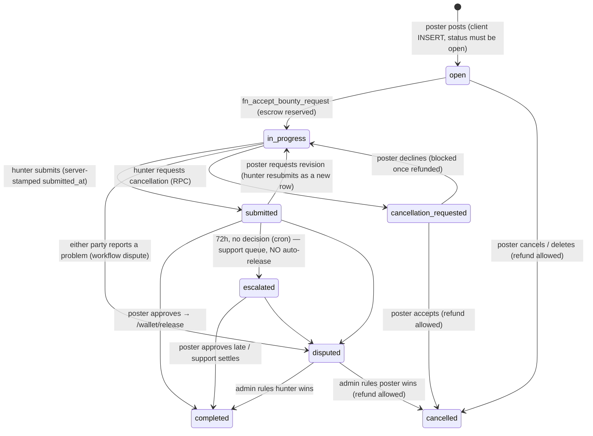

# Escrow commitment, poster recourse, 72-hour review window (2026-10-02)

Implements trust-spine audit T4 (remaining gaps), T6, T22 and Top improvements #3 and #6
(`docs/trust-spine-audit-2026-09-30.md`). Phase A only: **nothing in this change approves,
releases or refunds money automatically.**

**Status:** code + migrations written; verified on **staging** inside a rolled-back
transaction (`node scripts/verify-escrow-recourse-review-window.js`: 125/125). **Applied
nowhere.**

## Before you start: two pieces of drift on production

1. **`20261001130000_trust_spine_review_fixes` is live but unrecorded.** Its ledger row is
   missing from `supabase_migrations.schema_migrations`, but applying the file inside a
   rolled-back transaction on 2026-10-02 changed nothing: `fn_bounties_guard_lifecycle`,
   `fn_owner_refund_block_reason` (whitespace-normalised md5) and the
   `bounties_insert_active_owner` policy already equal what it installs. Record the ledger row
   (`20261001130000`, `trust_spine_review_fixes`); do not re-apply.
2. **`supabase/security/rls-manifest.json` is stale.** It still expects the pre-`130000`
   `bounties_insert_active_owner` WITH CHECK (no `status = 'open'` / `accepted_by IS NULL` /
   `accepted_request_id IS NULL` / `completed_at IS NULL` clauses), so
   `node scripts/check-rls-policies.js --env production` fails with 2 errors today and the
   pre-deploy gate in `deploy-edge-functions.yml` will block the next edge-function deploy.
   Regenerate the `bounties` block with `--print-protected` after review.

Staging is missing both `130000` and `140000`, so `check-rls-policies --env staging` currently
fails on 3 `bounties` policies. The test suite applies `130000` inside its transaction when
staging lacks it.

## What changes

| Migration | What it does |
|---|---|
| `20261002120000_assignment_and_submission_integrity` | Guard triggers on `bounty_requests` (the accepted application can't be rejected, deleted, re-pointed, or replaced by a client write; a client can't set `accepted`) and `completion_submissions` (only the accepted hunter submits, only on an `in_progress` bounty, one pending at a time; `submitted_at` / `reviewed_at` / `revision_count` and every reminder stamp are server-owned; each party can change only its own fields; review transitions are `pending → approved / revision_requested / rejected` and `revision_requested → approved`; a repeated approval is a no-op). |
| `20261002120100_review_window_and_recourse_queue` | `completion_review_policy` (72h window, 24h/48h reminders, rollout watermark); reminder/escalation stamps on `completion_submissions`; `bounty_disputes.reason_code`; `trust_review_queue` (support/founder queue, admin-read only); `trg_bounty_disputes_enqueue_review` (every new dispute becomes a queue item and pages internal admins); cron `completion-review-window` → `fn_process_completion_review_window()`; Phase B shadow rule `fn_completion_auto_release_blockers()`; admin RPCs `admin_trust_review_queue`, `admin_update_trust_review_item`, `admin_review_window_report`. |

Client (ships with the next build / OTA, **after** the DB):

- `app/bounty/[id]/dispute.tsx`: no longer requires a cancellation request. Without one it files
  a workflow dispute with a reason chip; posters get **"Hunter hasn't responded"** while no work
  is submitted. Shows an existing workflow dispute instead of "Dispute information not found".
- `components/bounty-card.tsx` / `my-posting-expandable.tsx`: the owner's **Cancel** on an
  in-progress bounty is now **Report a problem** (to the dispute screen). It used to open the
  hunter-only cancellation screen.
- `app/bounty/[id]/cancel.tsx`: the poster's dead end now offers **Report a problem**.
- `lib/utils/bounty-lifecycle.ts`: poster's `open_dispute` label is "Report a problem"; both
  sides' "awaiting approval" copy carries the deadline (`reviewDeadline`).
- `app/in-progress/[bountyId]/hunter/payout.tsx`, `app/postings/[bountyId]/review-and-verify.tsx`:
  deadline card ("The poster has until Friday at 3:00 PM to approve the work or raise a problem.
  If they don't respond, Bounty reviews it.").
- `app/admin/review-queue.tsx`: the founder queue (Admin → Review Queue).

## Lifecycle

`submitted` and `escalated` are not `bounties.status` values: the bounty stays `in_progress`
and the state lives on the latest `completion_submissions` row (`status = 'pending'`,
`review_escalated_at`).

### Who may do what after acceptance

| Action | Poster (client) | Hunter (client) | Server path |
|---|---|---|---|
| Refund escrow | ✗ (`refund_requires_cancellation_or_dispute`) | — | allowed after hunter cancellation or poster-wins ruling |
| Cancel / reopen / delete bounty | ✗ | — | dispute cascade, admin |
| Reassign `accepted_by` / `accepted_request_id` | ✗ | — | `fn_accept_bounty_request` only, and only from `open` |
| Reject / delete / re-point the accepted application | ✗ (new) | ✗ | — |
| Submit work | ✗ | ✓ accepted hunter only (new) | — |
| Backdate / forward-date `submitted_at` | ✗ (new) | ✗ (new) | cron only |
| Approve / request revision | ✓ | ✗ | — |
| Report a problem (workflow dispute) | ✓ | ✓ | — |
| Resolve a dispute | ✗ | ✗ | admin |

## Review window (cron)

`completion-review-window`, `7,22,37,52 * * * *`, heartbeat into `job_health`
(expectation: 45 min). Per run:

1. **Close decided queue items** (`resolution_source = 'system'`): overdue reviews become
   `poster_approved`, `poster_requested_revision`, `poster_rejected`, `disputed` or
   `bounty_closed`; dispute items take the ruling (`dispute_resolved_poster|hunter`, `dispute_closed`).
2. **For each latest pending submission** from the accepted hunter on an `in_progress`,
   undisputed bounty (`FOR UPDATE SKIP LOCKED`):
   - **+24h** → poster: "{hunter} is waiting on your review" (`review_needed` / `review_reminder` / `first`)
   - **+48h** → poster: "Last day to review" (`stage: final`). A late run sends only this one and
     stamps both.
   - **+72h** → `trust_review_queue` item, `bounty_events` `completion_review_overdue`
     (source `system`), poster "Bounty support is reviewing", hunter "Bounty support is following
     up", one page to internal admins per run. Shadow-evaluates the Phase B rule.
3. **No retroactive burst:** a threshold crossed before `rollout_at` notifies nobody. Work that
   was already past 72h at rollout is queued silently (`facts.legacy = true`). On prod today
   that is 5 submissions (the $5 `eccfddee` from 2026-08-18, 2 for-honor, 2 internal $1).

Idempotent: every step is watermarked; re-runs send nothing twice.

## Notifications

| When | To | Type / subtype | Copy (title) |
|---|---|---|---|
| +24h | poster | `review_needed` / `review_reminder` (first) | "{hunter} is waiting on your review" |
| +48h | poster | `review_needed` / `review_reminder` (final) | "Last day to review" |
| +72h | poster | `review_needed` / `review_escalated` | "Bounty support is reviewing" |
| +72h | hunter | `completion` / `review_escalated` | "Bounty support is following up" |
| +72h (batched per run) | internal admins | `reconciliation_alert` (`trust_review`) | "[Support] N reviews passed the 72h window" |
| new dispute | internal admins | `reconciliation_alert` (`trust_review`) | "[Support] Poster says the hunter hasn't responded" etc. |

Server copy is relative ("within 24 hours") because the server doesn't know the device time zone;
the app shows the absolute local time. The existing respondent notification for a new dispute is
still sent client-side by `dispute-service`.

## Production deployment sequence

Database first, then the client. No edge-function change ships in this work.

1. **Record the `20261001130000` ledger row** (its changes are already live; see above). Fix the
   stale manifest entry in the same PR.
2. Re-run `node scripts/verify-escrow-recourse-review-window.js` (staging, rolled back) → 125/125.
3. **Apply `20261002120000`**, then **`20261002120100`**, each on its own with an explicit go.
   With the Supabase MCP `apply_migration`, rename the local file to the recorded version after.
4. Verify read-only:
   - `SELECT jobname, schedule FROM cron.job WHERE jobname = 'completion-review-window';`
   - `SELECT * FROM completion_review_policy;` (`rollout_at` = apply time)
   - `SELECT tgname FROM pg_trigger WHERE tgname IN ('trg_bounty_requests_guard_assignment','trg_completion_submissions_guard','trg_bounty_disputes_enqueue_review');`
5. Ship the client (build/OTA). Old clients keep working: posters' Cancel still dead-ends until the
   update; their disputes insert without `reason_code`.
6. **Observe (done = observed rows):**
   - Within 15 min of apply: `job_health` row `completion-review-window`; `trust_review_queue`
     has the 5 legacy items (`facts->>'legacy' = 'true'`), and one admin page, no user notifications.
   - Every new pending submission: `review_reminder_24h_sent_at` stamped at +24h.
   - `bounty_events` `event_type = 'completion_review_overdue'` for every 72h escalation.
   - First poster "Hunter hasn't responded": a `bounty_disputes` row with `reason_code` and a
     `trust_review_queue` row with `kind = 'dispute'`.
   - Weekly: `SELECT admin_review_window_report();` (as an admin).

## Rollback

`supabase/rollbacks/production/20261002120100…down.sql`, then `…20261002120000…down.sql`.
The first one **drops the support queue**: export open items first. `bounty_events` rows stay.
Remove the two `schema_migrations` rows.

## Phase B: automatic release (prepared, NOT implemented)

**Gate:** `admin_review_window_report()` shows **≥ 20 observed escalations** (non-legacy,
non-internal), all resolved, with `shadow_eligible_contradicted = 0` (or an explicit, documented
tolerance). Every escalation already records `auto_release_eligible` and
`auto_release_blockers` from `fn_completion_auto_release_blockers()`. Phase B must call the same
function, so the shadow results describe the real rule.

**Rule (as shadowed today):** release at 72h when the submission is still pending, from the
accepted hunter, non-empty; the bounty is `in_progress`; there has never been a revision request
or a dispute on the bounty; no pending cancellation; the hunter's account is active; escrow is
funded (not for-honor); nothing was already released or refunded.

**What Phase B has to build:**

1. A server-side release entry point. `/wallet/release` authorizes the *poster's* JWT
   (`authorizeRelease` requires `callerId === bounties.user_id`). Phase B needs a service-role
   path (e.g. `POST /wallet/release-system`, cron-secret auth) that reuses `resolveReleasePayee`'s
   payee rule (`accepted_by` only), the same idempotency key (`release_{bountyId}_{hunterId}`),
   and routes v2/v3 bounties through `bounty-payments` (Stripe transfer) like the client does.
2. In the cron, at 72h with zero blockers and a policy flag set: enqueue that call (pg_net), then
   approve the submission and complete the bounty only after the release succeeds (the client's
   release → approve order caused the `payment_already_settled` case).
3. `bounty_events` `escrow_released` with `metadata.auto_release = true`; both parties notified.
4. A kill switch on `completion_review_policy` and a cap per run.

## Remaining policy decisions

1. **Minimum wait before "Hunter hasn't responded".** Filing is allowed any time after
   acceptance; the queue records `hours_since_acceptance` and the hunter's last message so
   support can triage. Should the app hold the option until N hours after acceptance or after the
   scheduled start?
2. **Withdrawing a report.** Dispute status is admin-only (20261001120000), so a poster whose
   hunter turns up can't withdraw. Support closes it. Add a participant "withdraw while open"?
3. **Rejection without a dispute.** A poster can set a submission to `rejected` (the DB allows it;
   no screen does). That stops the clock with the hunter unpaid. Should `rejected` require a
   dispute, or open one automatically?
4. **For-honor work** never auto-releases (nothing to release). Does Phase B auto-approve it?
5. **Support SLA.** The copy promises "Bounty reviews it", not a time. What response time do we
   commit to, and do we show it?
6. **Phase B tolerance.** Is one contradicted case in 20 acceptable, or must it be zero?
7. **Approved but unpaid.** If a poster approves and the payment never settles (lost webhook),
   the queue item closes as `poster_approved`. Payment reconciliation owns that today; confirm
   it alerts.
