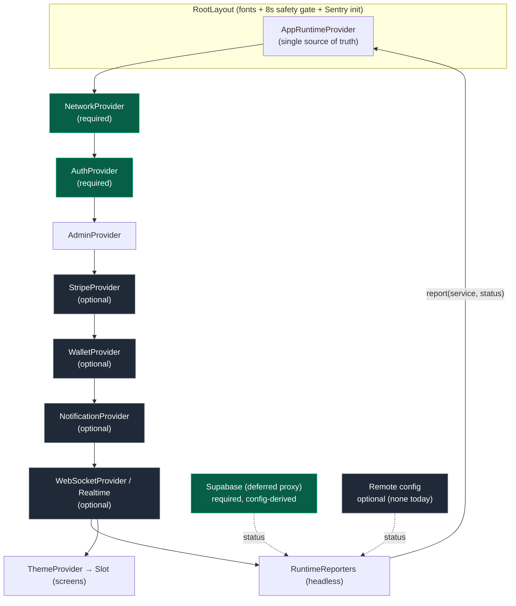
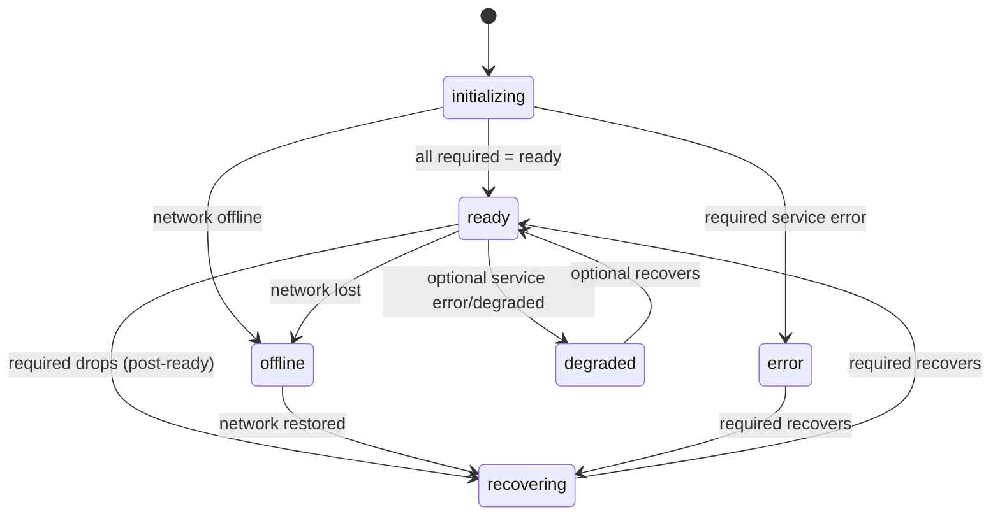

# Final Production Hardening & Runtime Readiness

_Date: 2026-07-22 · Scope: Startup orchestration, runtime readiness, observability_

This report documents the final production-hardening pass building on the
initialization/lifecycle hardening completed on 2026-07-22. It introduces a
single source of truth for application readiness, structured startup
diagnostics, and validates resilience under real-world startup conditions.

---

## 1. Startup Dependency Diagram

Provider nesting and readiness signal flow (root → leaf):

Readiness state machine (aggregate `RuntimePhase`):

**Aggregation policy (`computeRuntimePhase`):**

- **Required** services (`network`, `auth`, `supabase`) must all be `ready`
  before the app is `ready`.
- Network `offline` dominates all other states.
- A required-service error → `error`; an optional-service error/degrade →
  `degraded` (app remains usable).
- An optional service still `initializing` (e.g. realtime pre-login) does **not**
  block `ready`.
- A required service dropping _after_ a first `ready` yields `recovering`
  (distinct from first-boot `initializing`).

---

## 2. Remaining Architectural Risks

| Risk                                                                                         | Impact                                                                   | Mitigation / Status                                                                                                |
| -------------------------------------------------------------------------------------------- | ------------------------------------------------------------------------ | ------------------------------------------------------------------------------------------------------------------ |
| Supabase readiness is config-derived, not a live health probe                                | A configured-but-unreachable backend reports `ready` while network is up | Network + Auth guard the practical path; a lightweight `HEAD`/`getSession` probe could be added later              |
| Startup gating still uses `RootLayout` fonts + 8s safety timer, separate from `RuntimePhase` | Two loosely-coupled readiness notions                                    | Runtime phase is now the source of truth for screens; folding the splash gate onto `phase` is a low-risk follow-up |
| No remote-config service today                                                               | `remoteConfig` is trivially `ready`                                      | Slot reserved in the runtime; wire real signal when introduced                                                     |
| Optional-service `degraded` is aggregated but not yet surfaced in UI                         | Users not told when Stripe/Wallet degraded                               | Add a lightweight banner driven by `useAppRuntime().phase === 'degraded'`                                          |

---

## 3. Performance Improvements

- **No new blocking work on the boot path.** `RuntimeReporters` is a headless
  component doing only cheap effect-driven `report()` calls; `report()` is a
  no-op when a service's status is unchanged, preventing re-render/diagnostic
  churn.
- **Parallel-by-construction readiness.** Services report independently and
  asynchronously; the runtime never serializes initialization. Optional
  services (Stripe, Wallet, Notifications, Realtime) initializing in the
  background do not delay the `ready` transition.
- **Bounded diagnostics.** The in-memory timeline is capped (200 events) so
  long sessions cannot grow memory unbounded.
- **Zero heavy imports at module-eval.** `startup-diagnostics.ts` lazily
  `require`s Sentry inside a `try/catch`, preserving the mobile-safe,
  no-native-access-at-eval invariant.

---

## 4. Readiness Improvements

- Introduced `AppRuntimeProvider` — a **single source of truth** replacing
  fragmented per-screen loading flags.
- Unified `RuntimePhase`: `initializing | ready | degraded | recovering |
offline | error`.
- `time-to-ready` is measured and emitted on the first `ready` transition.
- Every provider now feeds one readiness policy via `RuntimeReporters`, keeping
  individual providers decoupled from orchestration.
- `useAppRuntime()` / `useOptionalAppRuntime()` expose readiness to any screen.

---

## 5. Startup Chaos Testing Results

Deterministic state-machine chaos scenarios are covered by
`__tests__/unit/providers/app-runtime-provider.test.ts` (14 tests). Combined
with the pre-existing lifecycle regression suites (24 tests), all pass.

| Scenario                           | Simulated by                          | Result                                                          |
| ---------------------------------- | ------------------------------------- | --------------------------------------------------------------- |
| Offline startup                    | `network: offline` → `offline` phase  | ✅ no crash, correct phase                                      |
| Online recovery                    | `offline` → all ready                 | ✅ transitions to `ready`                                       |
| Authentication delay               | `auth: initializing` (first boot)     | ✅ `initializing`, not error                                    |
| Auth drop after ready              | `auth: initializing`, `wasReady=true` | ✅ `recovering`                                                 |
| Required service error             | `supabase: error`                     | ✅ `error`                                                      |
| Slow/absent optional SDK           | `stripe/realtime: initializing`       | ✅ still `ready` (non-blocking)                                 |
| Optional SDK degraded              | `stripe: degraded`, `wallet: error`   | ✅ `degraded`, app usable                                       |
| Rapid status flapping              | repeated `report()` same status       | ✅ no-op, no re-render/log spam                                 |
| Diagnostics under listener failure | throwing subscriber                   | ✅ never throws, boot unaffected                                |
| Duplicate-listener safety          | mount/unmount lifecycle utils         | ✅ covered by lifecycle suite (`safeCleanup`, deferred cleanup) |

**Runtime-level validations covered by existing hardening (Phase 1–2):**
force-close relaunch, background/foreground, realtime reconnect storms, and
notification-during-startup are guarded by `mountedRef` guards, `safeCleanup`,
and `void removeChannel().catch()` across all providers.

---

## 6. Remaining Technical Debt (pre-public-launch)

1. **Live Supabase health probe** — replace config-derived readiness with a
   cheap reachability check to distinguish "configured" from "reachable".
2. **Fold the splash gate onto `RuntimePhase`** — retire the standalone 8s
   safety timer in `RootLayout` once `phase` drives the splash dismissal.
3. **Degraded-state UX** — surface `degraded`/`offline`/`recovering` to users
   via a global banner (`useAppRuntime`).
4. **Persist last-known readiness** — optionally cache the last `ready`
   snapshot to shorten perceived warm-launch time.
5. **Forward diagnostics timeline to support tooling** — expose
   `startupDiagnostics.getTimeline()` in a hidden debug screen / crash payload.
6. **Integration test with real providers** — add a `react-test-renderer` test
   that mounts `AppRuntimeProvider` + `RuntimeReporters` with mocked contexts to
   assert end-to-end phase transitions (current tests validate the pure policy).

---

## Files Added / Changed

- `providers/app-runtime-provider.tsx` — runtime manager + `computeRuntimePhase`.
- `providers/runtime-reporters.tsx` — headless readiness bridge.
- `lib/utils/startup-diagnostics.ts` — structured startup diagnostics.
- `app/_layout.tsx` — wrapped tree in `AppRuntimeProvider`, mounted
  `RuntimeReporters` inside the provider stack.
- `__tests__/unit/providers/app-runtime-provider.test.ts` — chaos + diagnostics
  tests.

**Validation:** `npx tsc --noEmit` → exit 0. Targeted Jest → 38 passed / 0
failed (14 new + 24 regression).
