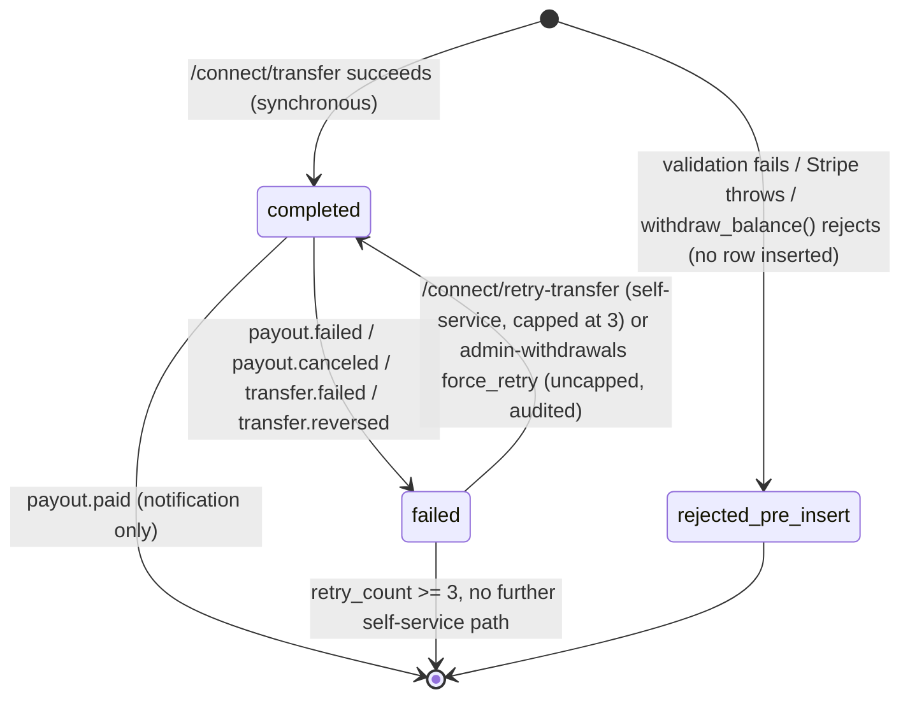

# Withdrawal System — Overview

> **Scope:** This is the entry point into `docs/withdrawals/`, a 6-document set covering the withdrawal system end to end. This page gives the big picture; for exhaustive detail see the companions listed at the bottom. It reflects the system as of **2026-07-21**, after the hardening pass described in [Production Readiness Review](../payments/BOUNTY_WITHDRAWAL_TECHNICAL_SPECIFICATION.md) and this session's follow-up work (new webhook handlers, admin recovery tool, scheduled reconciliation — see the Engineering Runbook for what changed).

## What a withdrawal is

A withdrawal moves a hunter's `profiles.balance` (an internal ledger balance — not a Stripe balance) to their bank account, via a Stripe Connect Express account. There is exactly one live withdrawal path in production. A second, more elaborate schema (`withdrawals` / `withdraw_balance_v2()`) existed in the database at one point and was dropped after being confirmed unused — ignore any reference to a `reserved` status or `cancel_withdrawal()`, those describe the dead schema.

## Architecture at a glance

```
Hunter's phone                Supabase Edge Functions              Stripe
─────────────                 ──────────────────────              ──────
withdraw-with-bank-screen.tsx
        │
        │ POST /connect/transfer
        ▼
                               connect/index.ts
                                 1. validate amount ($10–$10,000, USD)
                                 2. idempotency replay check
                                 3. resolve destination bank account
                                 4. withdraw_balance() RPC (debit, atomic)
                                 5. stripe.transfers.create() ──────────► Transfer created
                                    (SYNCHRONOUS — funds already moved     (platform → connected
                                     by the time this call returns)         account balance)
                                 6. INSERT wallet_transactions
                                    status: 'completed' (never 'pending')
        ◄──────────────────────  200 { transferId, status: completed }
   "Transfer initiated,
    1-2 business days"

                                                                    ... hours/days later,
                                                                    entirely Stripe-managed ...
                                                                            │
                                                                            ▼
                                                                    Payout created
                                                                    (connected account
                                                                     → hunter's bank)
                               webhooks/index.ts  ◄─────────────────────── payout.paid /
                                 routes by event type:                     payout.failed /
                                 - success → notify only                   payout.canceled /
                                 - failure → refund balance,                payout.updated
                                   mark row 'failed', notify
```

**The two Stripe objects, and which one this codebase actually controls:**

| Object | Direction | Synchronous? | Controlled by Bounty's code? |
|---|---|---|---|
| **Transfer** | Platform Stripe balance → connected account's Stripe balance | Yes — completes inside the `/connect/transfer` request | Yes — this is the API call the edge function makes |
| **Payout** | Connected account's Stripe balance → hunter's bank | No — Stripe's own schedule | No — Bounty only reacts to webhook events after the fact |

This two-hop design is the single most important thing to understand about this system: **`status: 'completed'` in the app means the Transfer succeeded, not that money has reached the hunter's bank.** The Payout leg is invisible to the app except through webhooks. See the [Support Runbook](02-support-runbook.md) for how this shapes almost every "where's my money" conversation.

## Why the Transfer is recorded `'completed'`, never `'pending'`

`stripe.transfers.create()` for this specific operation (platform balance → connected account balance) does not deliver a `transfer.paid` webhook — that event belongs to a legacy recipient-transfer API. If the row were inserted as `'pending'` and the code waited for a webhook to promote it, nothing would ever promote it, and the row would be stuck forever. **This is not a hypothetical** — this exact regression shipped to production on 2026-07-17 via an out-of-band deploy and left a real $38 withdrawal stuck for over 24 hours before detection (see the Operations Playbook's incident history). If you ever see this code path write `'pending'` on the synchronous-success branch, treat it as an active incident.

## State machine



`'pending'` exists in the `status` CHECK/enum but a correctly-behaving `/connect/transfer` never writes it for a new withdrawal — its presence is defensive/forward-compatible only, and any `'pending'` row older than a few minutes is itself the alert (see the reconciliation job below).

## Balance movement

`profiles.balance` is debited **before** the Stripe Transfer is attempted, via `withdraw_balance()` — a `SECURITY DEFINER` RPC that row-locks the profile (`SELECT ... FOR UPDATE`), checks `balance_frozen` and `balance - balance_on_hold >= amount`, and returns the new balance atomically. If the subsequent Stripe call fails, the debit is reversed via `update_balance()`. If the reversal itself fails, that's a CRITICAL-logged, manual-reconciliation case — see the Engineering Runbook.

Both RPCs are `service_role`-only (verified live) and additionally protected by a `BEFORE UPDATE` trigger on `profiles` that blocks any non-service-role write to `balance` and ~34 other sensitive columns, regardless of table grants — this closes the class of bug where a client could call `supabase.from('profiles').update({balance: 999999})` directly.

## Webhook flow

`supabase/functions/webhooks/index.ts` handles 19 Stripe event types. The withdrawal-relevant ones:

| Event | Effect |
|---|---|
| `transfer.created` | Backfills `stripe_transfer_id` onto the matching row if missing (defensive) |
| `transfer.paid` | Marks the row `'completed'` (defensive — this event is not normally delivered for this Transfer type, see above) |
| `transfer.failed` | Refunds the balance, marks `'failed'`, follows a 3-strike retry ladder |
| `transfer.reversed` | Refunds the balance, marks `'failed'`, **always** treated as permanently failed and CRITICAL-logged — nothing in this codebase reverses a Transfer, so this should never fire under normal operation |
| `payout.paid` | Notification only, no balance action |
| `payout.failed` | Refunds the balance (the Transfer succeeded but the bank-level Payout didn't), marks `'failed'`, notifies |
| `payout.canceled` | Same refund mechanics as `payout.failed`, distinct customer copy (a canceled payout never reached the bank) |
| `payout.updated` | Status-tracking only (`metadata.payout_status`), no balance action |
| `account.updated` / `capability.updated` | Syncs Connect capability flags onto `profiles` |
| `account.application.deauthorized` | Clears the profile's Connect capability flags immediately, so the next withdrawal attempt fails cleanly instead of hitting a stale/disconnected account |

**Operational note:** subscribing to an event type in code does not retroactively enable delivery — each event type must also be enabled in the Stripe Dashboard's webhook endpoint configuration. `payout.canceled`, `transfer.reversed`, `payout.updated`, and `account.application.deauthorized` were all added to the code in recent sessions; **confirm in the Stripe Dashboard that all four are actually subscribed**, per the Operations Playbook's webhook verification checklist.

## Retries

- **Self-service** (`POST /connect/retry-transfer`): capped at 3 attempts per transaction, tracked in `metadata.retry_count`. A 4th attempt returns `maxRetriesReached: true` and the app tells the hunter to contact support.
- **Admin-initiated** (`POST /admin-withdrawals` action `force_retry`): uncapped, requires an admin-role JWT, requires a written reason, and is fully audited in `admin_action_log`. This closed a real gap — previously a `permanently_failed` withdrawal had no automated recovery path at all short of an engineer running SQL directly against production.

## Failure recovery

Every money-touching failure path in `connect/index.ts` and `webhooks/index.ts` either refunds the balance automatically or, if the refund itself fails, emits a `CRITICAL`-prefixed structured log line for manual reconciliation. As of this pass, there is also a **daily scheduled job** (`run_withdrawal_reconciliation()`, via `pg_cron`) that independently checks for balance drift, stuck-pending withdrawals, orphaned transactions, duplicate idempotency keys, and Connect-account mismatches — writing findings to `reconciliation_findings` rather than relying solely on someone reading logs or running the manual SQL script. See the Operations Playbook for the daily triage procedure.

## Known, deliberately-not-fixed architectural limitations

Two things are true today and are **accepted, documented limitations**, not oversights:

1. **Per-withdrawal destination precision.** The hunter's selected bank account is now correctly wired through and promoted to `default_for_currency` before the Transfer is created — but Stripe's *automatic* payout sweep pulls the connected account's *entire* available balance on its own schedule. Two withdrawals with different bank-account selections landing before the same sweep still get swept together to whatever is default *at sweep time*. Closing this fully requires switching to Stripe manual payouts with an explicit `destination` per withdrawal — an architectural change, evaluated but not made in this pass; see [07-manual-payouts-evaluation.md](07-manual-payouts-evaluation.md).
2. **`profiles` table SELECT RLS is broader than it should be** (app-wide, not withdrawal-specific) — flagged in three prior audits, now converted into an actual sequenced migration plan rather than left as an open question; see [08-profiles-rls-migration-strategy.md](08-profiles-rls-migration-strategy.md).

**Corrected 2026-07-18** — this used to say "no isolated test environment exists." That was wrong: a genuinely Stripe-test-mode Supabase branch (Staging) exists, it just has stale code/schema. See the [Testing Guide](06-testing-guide.md) for current status.

## Document map

| Doc | Audience | Purpose |
|---|---|---|
| **01-system-overview.md** (this doc) | Everyone | Orientation |
| [02-support-runbook.md](02-support-runbook.md) | L1 support | Resolve tickets without engineering |
| [03-engineering-runbook.md](03-engineering-runbook.md) | Engineers | APIs, RPCs, tables, SQL, debugging |
| [04-automation-handler-guide.md](04-automation-handler-guide.md) | Future AI/automation agents | Decision tree, diagnostics, resolution boundaries |
| [05-operations-playbook.md](05-operations-playbook.md) | On-call / ops | Daily checks, incident response, deploy checklist |
| [06-testing-guide.md](06-testing-guide.md) | Engineers | What's actually tested vs. what requires manual live-mode verification, current Staging environment status |
| [07-manual-payouts-evaluation.md](07-manual-payouts-evaluation.md) | Engineers / product | Should we switch to Stripe manual payouts? Advantages, risks, migration effort |
| [08-profiles-rls-migration-strategy.md](08-profiles-rls-migration-strategy.md) | Engineers | Sequenced plan to tighten `profiles` SELECT RLS without breaking the admin panel or search |

Deeper architecture/state-machine/security material that predates this doc set and remains accurate: `docs/payments/WITHDRAWAL_SYSTEM_RUNBOOK.md`, `docs/payments/BOUNTY_WITHDRAWAL_TECHNICAL_SPECIFICATION.md`.
